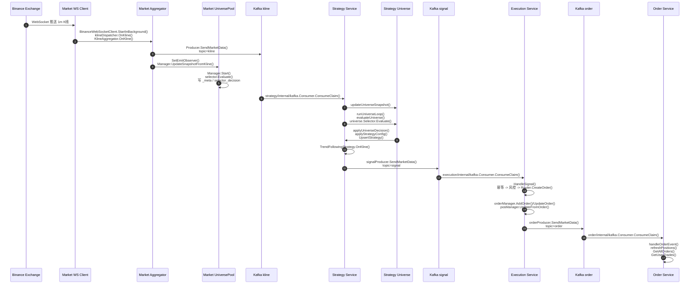
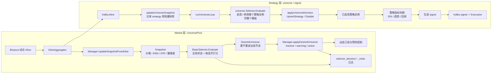
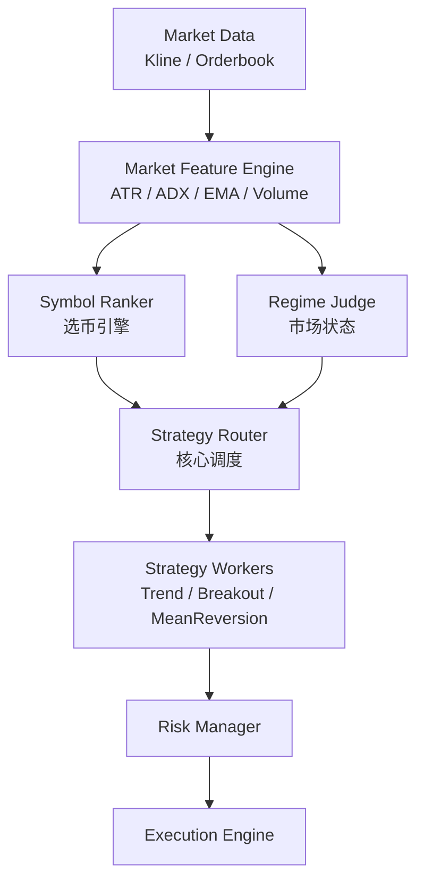
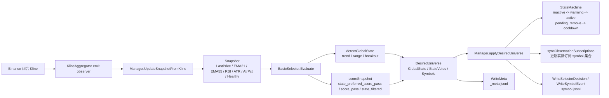

# 实盘盈利系统架构图

> **项目名称**: exchange-system  
> **技术栈**: go-zero + gRPC + Kafka + etcd + Redis  
> **核心功能**: 加密货币合约交易自动化策略系统  

## 核心目标

```text
这个引擎优先解决 3 件事：
1. 自动选币（今天该做谁）
2. 自动选策略（这个币用什么打法）
3. 自动分仓（资金怎么分配）
```

```text
本质不是“人选币 + 固定策略”。
而是系统基于市场状态和风险约束做动态决策，
自动完成标的选择、策略匹配和资金分配。
```

---

## 一、系统总览图

```
┌──────────────────────────────────────────────────────────────────────────────────────────────────┐
│                                          客户端层                                                  │
│  ┌──────────────────┐  ┌──────────────────┐  ┌──────────────────┐                                │
│  │   Web Dashboard  │  │   API Client     │  │   Mobile App     │                                │
│  └────────┬─────────┘  └────────┬─────────┘  └────────┬─────────┘                                │
│           │                     │                     │                                          │
│           └─────────────────────┴─────────────────────┘                                          │
│                                 │                                                                │
│                              HTTP/REST                                                           │
└─────────────────────────────────┼────────────────────────────────────────────────────────────────┘
                                  │
┌─────────────────────────────────┼────────────────────────────────────────────────────────────────┐
│                                 ▼                     接入层                                      │
│                    ┌─────────────────────────┐                                                   │
│                    │    API Gateway          │  go-zero HTTP Gateway                             │
│                    │    (gateway.yaml)       │  路由分发: 账户/订单/策略/状态                     │
│                    └────┬──┬──┬──┬───────────┘                                                   │
│                         │  │  │  │                                                              │
│                    ┌────┘  │  │  └─────┐                                                        │
│                    ▼       ▼  ▼        ▼                                                         │
└──────────────────────────────────────────────────────────────────────────────────────────────────┘
                                  │
                                  ▼ gRPC
┌──────────────────────────────────────────────────────────────────────────────────────────────────┐
│                                       微服务层                                                     │
│                                                                                                  │
│  ┌────────────────────┐  ┌────────────────────┐  ┌────────────────────┐  ┌────────────────────┐ │
│  │  Market Service    │  │  Strategy Service  │  │  Execution Service │  │   Order Service    │ │
│  │ (market.demo/      │  │ (strategy.demo/    │  │  (execution.yaml)  │  │  (order.yaml)      │ │
│  │  market.prod)      │  │  strategy.prod)    │  │                    │  │                    │ │
│  │                    │  │                    │  │                    │  │                    │ │
│  │                    │  │                    │  │                    │  │                    │ │
│  │ • WebSocket Client │  │ • Trend Following  │  │ • Exchange Router  │  │ • Order Query      │ │
│  │ • Kline Aggregator │  │ • HarvestPath LSTM │  │ • Risk Manager     │  │ • Position Query   │ │
│  │ • Indicators       │  │ • Signal Stream    │  │ • Order Manager    │  │ • Income History   │ │
│  │ • Depth Stream     │  │ • Kafka Consumer   │  │ • Position Manager │  │ • Funding Fees     │ │
│  └────────┬───────────┘  └────────┬───────────┘  └────────┬───────────┘  └────────┬───────────┘ │
│           │                      │                      │                      │               │
└───────────┼──────────────────────┼──────────────────────┼──────────────────────┼───────────────┘
            │                      │                      │                      │
            ▼                      ▼                      ▼                      ▼
┌──────────────────────────────────────────────────────────────────────────────────────────────────┐
│                                      消息中间件层                                                  │
│                                                                                                  │
│  ┌──────────────────────────────────────────────────────────────────────────────────────────┐    │
│  │                              Apache Kafka 3.8.1                                          │    │
│  │                                                                                          │    │
│  │  Topics:                                                                                 │    │
│  │  • kline                → Market Service 发布聚合K线数据                                  │    │
│  │  • signal               → Strategy Service 发布交易信号                                   │    │
│  │  • order                → Execution Service 发布订单状态事件                              │    │
│  │  • harvest_path_signal  → Strategy Service 发布收割路径风险信号                           │    │
│  └──────────────────────────────────────────────────────────────────────────────────────────┘    │
│                                                                                                  │
└──────────────────────────────────────────────────────────────────────────────────────────────────┘
            │                      │                      │                      │
            ▼                      ▼                      ▼                      ▼
┌──────────────────────────────────────────────────────────────────────────────────────────────────┐
│                                      数据存储层                                                    │
│                                                                                                  │
│  ┌──────────────────┐  ┌──────────────────┐  ┌──────────────────┐  ┌──────────────────┐         │
│  │      etcd        │  │      Redis       │  │  JSONL Files     │  │  LSTM Models     │         │
│  │                  │  │                  │  │                  │  │                  │         │
│  │ • 服务注册发现   │  │ • 幂等控制       │  │ • K线日志        │  │ • .pt 模型文件   │         │
│  │ • 配置中心       │  │ • 订单状态缓存   │  │ • 信号日志       │  │ • .json 配置     │         │
│  │ • 分布式锁       │  │ • 持仓状态       │  │ • 持仓记录       │  │ • Python 训练    │         │
│  └──────────────────┘  └──────────────────┘  └──────────────────┘  └──────────────────┘         │
│                                                                                                  │
└──────────────────────────────────────────────────────────────────────────────────────────────────┘
            │
            ▼
┌──────────────────────────────────────────────────────────────────────────────────────────────────┐
│                                     外部交易所 API                                                 │
│                                                                                                  │
│  ┌──────────────────┐  ┌──────────────────┐                                                      │
│  │    Binance       │  │      OKX         │                                                      │
│  │                  │  │                  │                                                      │
│  │ • REST API       │  │ • REST API       │                                                      │
│  │ • WebSocket      │  │ • WebSocket      │                                                      │
│  │ • 合约交易       │  │ • 合约交易       │                                                      │
│  └──────────────────┘  └──────────────────┘                                                      │
│                                                                                                  │
└──────────────────────────────────────────────────────────────────────────────────────────────────┘
```

---

## 二、核心业务流程图

### 2.1 市场数据流 (Market Data Pipeline)

```
┌─────────────┐
│  Binance    │ WebSocket 原始行情
│  Exchange   │────────────────────────┐
└─────────────┘                        │
                                       ▼
                          ┌─────────────────────────┐
                          │  Market Service          │
                          │                          │
                          │  1. WebSocket Client     │
                          │     接收原始K线数据       │
                          │                          │
                          │  2. Kline Aggregator     │
                          │     聚合为多周期K线       │
                          │     • 1m (基准)          │
                          │     • 15m                │
                          │     • 1h                 │
                          │     • 4h                 │
                          │                          │
                          │  3. Technical Indicators │
                          │     计算技术指标          │
                          │     • EMA21 / EMA55      │
                          │     • RSI (14)           │
                          │     • ATR (14)           │
                          │                          │
                          │  4. Watermark 机制       │
                          │     • EmitWatermark 模式 │
                          │     • EmitImmediate 模式 │
                          │     • 延迟容忍: allowedLateness │
                          │                          │
                          │  5. History Warmup       │
                          │     预热历史数据(4500根) │
                          └────────┬─────────────────┘
                                   │
                                   ▼
                    ┌──────────────────────────────┐
                    │        Kafka Topic           │
                    │    kline                     │
                    └────────┬─────────────────────┘
                             │
                             ▼
          ┌──────────────────────────────────────┐
          │       Strategy Service 消费          │
          └──────────────────────────────────────┘
```

### 2.2 策略交易信号流 (Strategy Signal Pipeline)

```
┌──────────────────────────────────────────────────────────────────────────────┐
│                            Strategy Service                                   │
│                                                                              │
│  ┌────────────────────────────────────────────────────────────────────────┐  │
│  │                        多周期趋势跟踪策略                                │  │
│  │                                                                        │  │
│  │   第1层: 4H趋势判断                                                     │  │
│  │   ┌──────────────────────────────────────────────────────────────┐     │  │
│  │   │  多头趋势: 价格 > EMA21 > EMA55                               │     │  │
│  │   │  空头趋势: 价格 < EMA21 < EMA55                               │     │  │
│  │   │  震荡: 切换到震荡交易策略                                      │     │  │
│  │   └──────────────────────────────────────────────────────────────┘     │  │
│  │                              │                                         │  │
│  │                              ▼                                         │  │
│  │   第2层: 1H回调确认                                                    │  │
│  │   ┌──────────────────────────────────────────────────────────────┐     │  │
│  │   │  多头回调: EMA21 > 价格 > EMA55 + RSI∈[42,60]                │     │  │
│  │   │  空头回调: EMA21 < 价格 < EMA55 + RSI∈[40,58]                │     │  │
│  │   │  深回调: |价格-EMA55|/EMA55 ≤ 0.3%                           │     │  │
│  │   └──────────────────────────────────────────────────────────────┘     │  │
│  │                              │                                         │  │
│  │                              ▼                                         │  │
│  │   第3层: 15M入场信号                                                   │  │
│  │   ┌──────────────────────────────────────────────────────────────┐     │  │
│  │   │  结构突破: 收盘价突破近N根K线高低点                            │     │  │
│  │   │  RSI信号: RSI穿越50中线 或 达到偏置阈值                        │     │  │
│  │   │  模式: OR (默认) / AND                                        │     │  │
│  │   └──────────────────────────────────────────────────────────────┘     │  │
│  │                              │                                         │  │
│  │                              ▼                                         │  │
│  │   风控层: Risk Management                                              │  │
│  │   ┌──────────────────────────────────────────────────────────────┐     │  │
│  │   │  • 连续亏损限制 (max_consecutive_losses)                      │     │  │
│  │   │  • 日亏损限制 (max_daily_loss_pct)                            │     │  │
│  │   │  • 最大回撤限制 (max_drawdown_pct)                            │     │  │
│  │   │  • 最大同时持仓数 (max_positions)                             │     │  │
│  │   │  • HarvestPath LSTM 风险过滤 (可选)                           │     │  │
│  │   └──────────────────────────────────────────────────────────────┘     │  │
│  │                              │                                         │  │
│  │                              ▼                                         │  │
│  │   仓位计算: Position Sizing                                            │  │
│  │   ┌──────────────────────────────────────────────────────────────┐     │  │
│  │   │  1. 风险仓位 = (权益 × 风险比例) ÷ (ATR × 止损倍数)           │     │  │
│  │   │  2. 现金限制 = (权益 × 最大仓位比例) ÷ 价格                   │     │  │
│  │   │  3. 杠杆限制 = (权益 × 杠杆 × 最大杠杆使用率) ÷ 价格          │     │  │
│  │   │  4. 基础仓位 = min(风险仓位, 现金限制, 杠杆限制)              │     │  │
│  │   │  5. 最终仓位 = 基础仓位 × 回撤缩放                            │     │  │
│  │   └──────────────────────────────────────────────────────────────┘     │  │
│  │                              │                                         │  │
│  └──────────────────────────────┼─────────────────────────────────────────┘  │
│                                 │                                            │
│                                 ▼                                            │
│                    ┌────────────────────────┐                                │
│                    │  发送交易信号到 Kafka   │                                │
│                    │  Topic: signal         │                                │
│                    └────────────────────────┘                                │
│                                                                              │
│  ┌────────────────────────────────────────────────────────────────────────┐  │
│  │                        信号模式切换                                     │  │
│  │                                                                        │  │
│  │  signal_mode = 0 (默认): 15m信号模式                                    │  │
│  │  • 入场/出场周期: 15m K线                                               │  │
│  │  • 判断依据: 4H趋势 + 1H回调 + 15M入场                                  │  │
│  │                                                                        │  │
│  │  signal_mode = 1: 1m信号模式                                            │  │
│  │  • 入场/出场周期: 1m K线                                                │  │
│  │  • 判断依据: 4H趋势 + 1H回调 + 1M入场                                   │  │
│  │  • 1m_trading_paused = 1: 暂停1m成交，降级到15m模式                     │  │
│  │                                                                        │  │
│  └────────────────────────────────────────────────────────────────────────┘  │
└──────────────────────────────────────────────────────────────────────────────┘
```

补充说明：
- 当上游路由结果落到 `range` 桶时，运行时不再简单按“震荡不交易”处理，而是切换到独立的震荡交易策略变体。
- 震荡交易策略的完整设计说明、参数定义和风控细节见 [volatility_strategy_technical_doc.md](file:///Users/bytedance/GolandProjects/exchange-system/docs/volatility_strategy_technical_doc.md)。

### 2.3 订单执行流 (Order Execution Pipeline)

```
┌──────────────────────────────────────────────────────────────────────────────┐
│                            Execution Service                                  │
│                                                                              │
│  ┌────────────────────────────────────────────────────────────────────────┐  │
│  │                          订单执行流程                                    │  │
│  │                                                                        │  │
│  │  1. 接收信号                                                            │  │
│  │     ┌──────────────────────────────────────────────────────────────┐   │  │
│  │     │  • Kafka: signal topic（当前策略主链路）                        │   │  │
│  │     │  • gRPC: CreateOrder RPC（人工/调试直调入口）                   │   │  │
│  │     └──────────────────────────────────────────────────────────────┘   │  │
│  │                              │                                         │  │
│  │                              ▼                                         │  │
│  │  2. 风控校验 (Risk Manager)                                            │  │
│  │     ┌──────────────────────────────────────────────────────────────┐   │  │
│  │     │  • 仓位限制检查                                                │   │  │
│  │     │  • 资金风险校验                                                │   │  │
│  │     │  • 交易频率控制                                                │   │  │
│  │     │  • 符号/方向/数量验证                                          │   │  │
│  │     └──────────────────────────────────────────────────────────────┘   │  │
│  │                              │                                         │  │
│  │                              ▼                                         │  │
│  │  3. 幂等控制 (Idempotent)                                              │  │
│  │     ┌──────────────────────────────────────────────────────────────┐   │  │
│  │     │  • Redis 记录 client_order_id                                 │   │  │
│  │     │  • 防止重复下单                                                │   │  │
│  │     │  • TTL: 24h                                                   │   │  │
│  │     └──────────────────────────────────────────────────────────────┘   │  │
│  │                              │                                         │  │
│  │                              ▼                                         │  │
│  │  4. 交易所路由 (Exchange Router)                                       │  │
│  │     ┌──────────────────────────────────────────────────────────────┐   │  │
│  │     │  ┌──────────────┐  ┌──────────────┐  ┌──────────────┐       │   │  │
│  │     │  │   Binance    │  │     OKX      │  │  Simulated   │       │   │  │
│  │     │  │  Interface   │  │  Interface   │  │  Interface   │       │   │  │
│  │     │  └──────────────┘  └──────────────┘  └──────────────┘       │   │  │
│  │     └──────────────────────────────────────────────────────────────┘   │  │
│  │                              │                                         │  │
│  │                              ▼                                         │  │
│  │  5. 订单管理 (Order Manager)                                           │  │
│  │     ┌──────────────────────────────────────────────────────────────┐   │  │
│  │     │  • 跟踪订单生命周期                                            │   │  │
│  │     │  • 状态机: NEW→FILLED/CANCELED/REJECTED                       │   │  │
│  │     │  • 订单日志记录                                                │   │  │
│  │     └──────────────────────────────────────────────────────────────┘   │  │
│  │                              │                                         │  │
│  │                              ▼                                         │  │
│  │  6. 仓位管理 (Position Manager)                                        │  │
│  │     ┌──────────────────────────────────────────────────────────────┐   │  │
│  │     │  • 更新本地持仓状态                                            │   │  │
│  │     │  • 计算盈亏                                                    │   │  │
│  │     │  • 同步交易所实际仓位                                          │   │  │
│  │     └──────────────────────────────────────────────────────────────┘   │  │
│  │                              │                                         │  │
│  │                              ▼                                         │  │
│  │  7. 发布订单事件                                                        │  │
│  │     ┌──────────────────────────────────────────────────────────────┐   │  │
│  │     │  • Kafka: order topic                                         │   │  │
│  │     │  • Order Service 消费用于查询                                  │   │  │
│  │     └──────────────────────────────────────────────────────────────┘   │  │
│  │                                                                        │  │
│  └────────────────────────────────────────────────────────────────────────┘  │
└──────────────────────────────────────────────────────────────────────────────┘
```

### 2.4 完整交易闭环时序图

```
┌────────┐  ┌──────────┐  ┌──────────┐  ┌──────────┐  ┌──────────┐  ┌──────────┐
│ Client │  │ Gateway  │  │  Market  │  │ Strategy │  │Execution │  │ Exchange │
└───┬────┘  └────┬─────┘  └────┬─────┘  └────┬─────┘  └────┬─────┘  └────┬─────┘
    │            │             │             │             │             │
    │ 请求启动策略│             │             │             │             │
    │───────────>│             │             │             │             │
    │            │  gRPC调用   │             │             │             │
    │            │────────────>│             │             │             │
    │            │             │             │             │             │
    │            │             │ WebSocket连接│             │             │
    │            │             │<────────────────────────────────────────│
    │            │             │             │             │             │
    │            │             │ 推送K线数据 │             │             │
    │            │             │────────────>│             │             │
    │            │             │             │             │             │
    │            │             │      Kafka: kline        │             │
    │            │             │─────────────────────────>│             │
    │            │             │             │             │             │
    │            │             │  策略判断   │             │             │
    │            │             │  4H+1H+15M  │             │             │
    │            │             │  三层过滤   │             │             │
    │            │             │             │             │             │
    │            │             │  生成交易信号│             │             │
    │            │             │             │             │             │
    │            │             │     Kafka: signal        │             │
    │            │             │─────────────────────────>│             │
    │            │             │             │             │             │
    │            │             │             │   风控校验  │             │
    │            │             │             │   幂等控制  │             │
    │            │             │             │   交易所路由│             │
    │            │             │             │             │             │
    │            │             │             │  下单请求   │             │
    │            │             │             │────────────>│             │
    │            │             │             │             │             │
    │            │             │             │  订单回报   │             │
    │            │             │             │<────────────│             │
    │            │             │             │             │             │
    │            │             │      Kafka: order        │             │
    │            │             │<─────────────────────────│             │
    │            │             │             │             │             │
    │  查询订单状态│             │             │             │             │
    │<───────────│             │             │             │             │
    │            │             │             │             │             │
    │            │             │  持续监控持仓│             │             │
    │            │             │  止损/止盈检查│             │             │
    │            │             │             │             │             │
```

### 2.5 当前代码链路 Mermaid 时序图

说明:

- 以下时序图按当前仓库代码整理，优先反映真实函数跳转和实际 topic 名
- 当前真实 topic 以 `kline`、`signal`、`order` 为准，不再使用旧文档中的 `market_data`、`strategy_signals`、`order_events`
- `market` 和 `strategy` 都有各自的 universe 逻辑，前者偏市场侧动态币池，后者偏策略实例启停



建议阅读顺序:

```text
如果你现在的目标是理解 “market 的 UniversePool、strategy 的 universe，以及最终 signal 各自负责什么”，
推荐按下面顺序往下看：

1. 先看 2.5
   目标：先建立真实代码链路和 topic 流向
2. 再看 2.6
   目标：看懂 UniversePool / Strategy Universe / Signal 的三层职责边界
3. 最后看 3.3.6
   目标：只展开 market 侧 UniversePool 的日志字段、状态机和排查方法
```

### 2.6 UniversePool 与 Strategy Universe / Signal 职责分层

说明:

- 这一层图专门回答一个常见问题: `strategy` 已经会做策略判断，为什么上游还需要 `UniversePool`
- 结论是三层职责并不重复，而是分别解决 `看谁`、`启哪个策略`、`此刻要不要交易`



三层职责说明:

```text
1. UniversePool: 先决定“看谁”
   • 所在位置: market
   • 核心输入: 聚合后的 1m Kline 快照
   • 核心输出: 哪些 symbol 进入动态币池，以及 inactive / warming / active 状态迁移
   • 主要作用:
     - 先挡掉 no_snapshot / stale_snapshot / unhealthy
     - 根据 trend / range / breakout 做市场侧粗筛
     - 控制观察订阅、预热和日志证据

2. Strategy Universe: 再决定“启哪个策略模板”
   • 所在位置: strategy
   • 核心输入: strategy 侧最近一根 1m 快照 + marketstate
   • 核心输出: 某个 symbol 对应的策略实例是否启用，当前使用哪个 template
   • 主要作用:
     - 把可运行 symbol 映射成具体策略模板
     - 在高波动、脏数据、非趋势条件下临时禁用某些策略实例
     - 让同一个 symbol 在不同环境下切换更合适的模板

3. Signal: 最后决定“此刻要不要交易”
   • 所在位置: strategy 具体策略实例
   • 核心输入: 已启用 symbol 的实时指标与持仓上下文
   • 核心输出: OPEN / CLOSE 等交易信号
   • 主要作用:
     - 判断当前这一根 Kline 是否满足入场 / 出场条件
     - 生成真正发往 execution 的 signal
     - 这是交易决策细判，不负责 market 侧订阅治理
```

一句话总结:

```text
UniversePool 管“入池”，Strategy Universe 管“启哪个策略”，Signal 管“现在下不下单”。
```

延伸阅读:

```text
如果你接下来想继续只看 market 侧 UniversePool 的真实输入、selector_decision、_meta 字段和状态机推进，
可以直接跳到 3.3.6《Market UniversePool 判读标准》。
```

### 2.7 职责导向目标架构图

说明:

- 这张图不是对当前代码文件结构的逐行翻译，而是对“更清晰的职责分层目标”做抽象
- 它最适合回答的问题是：如果后面要继续演进 `选币 / 市场状态 / 策略路由 / 多策略 worker`，应该按什么边界拆



当前实现映射:

```text
1. Market Data
   • 当前主要对应 market 服务接收 Binance WebSocket，并向 Kafka `kline` 发布聚合 K 线

2. Market Feature Engine
   • 当前主要分散在 KlineAggregator、指标计算、UniversePool snapshot 构建中
   • 已经具备 EMA / RSI / ATR 等能力，但还没有被显式抽成统一特征层

3. Symbol Ranker
   • 当前最接近 market 侧的 UniversePool / BasicSelector
   • 负责候选币打分、过滤、偏好币放行和动态币池推进

4. Regime Judge
   • 当前一部分在 market 侧 UniversePool 的 global_state 判断
   • 另一部分在 strategy 侧 marketstate 检测
   • 功能已存在，但还没有完全收敛成单一判态层

5. Strategy Router
   • 当前最接近 strategy 侧 universe.Selector + applyUniverseDecision
   • 现在主要做策略实例启停和模板切换，还不是完整的策略路由中心

6. Strategy Workers
   • 当前主力仍是 TrendFollowingStrategy
   • Breakout / MeanReversion 还没有完全独立成并列 worker

7. Risk Manager / Execution Engine
   • 当前已经比较清晰
   • strategy 侧负责部分信号风控，execution 侧负责更硬的执行风控与下单
```

目标演进方向:

```text
1. 先把 Market Feature Engine 显式抽出来
   • 统一 ATR / ADX / EMA / Volume / Orderbook 等特征输入
   • 避免不同 selector / strategy 重复计算和重复解释

2. 再把 Symbol Ranker 和 Regime Judge 解耦
   • 让“选什么币”和“当前市场是什么状态”变成两块可独立演进的能力
   • 避免把过多职责继续堆在 UniversePool 一层

3. 把 strategy universe 升级成真正的 Strategy Router
   • 不只做启停和模板切换
   • 还负责把不同 symbol 在不同 regime 下路由给更合适的策略 worker

4. 把 Trend / Breakout / MeanReversion 变成独立 worker
   • 共享统一特征输入
   • 保持各自的信号逻辑、风控参数和可观测性

5. 再让 Orderbook 与更多 regime 特征进入主链路
   • 把目前偏 Kline 驱动的架构，逐步演进成“特征驱动 + 路由驱动”的架构
```

一句话理解:

```text
当前系统已经具备这张图里的大部分零件，但它们还分散在 market / strategy 内部；后续演进重点不是“再加更多逻辑”，而是把已有能力按职责边界重新收拢。
```

### 2.8 核心模块设计（重点）

说明:

- 这一节不是对当前代码目录的逐文件解释，而是对目标引擎中最关键的模块边界做设计说明
- 当前优先展开两层：`Feature Engine` 和 `Symbol Ranker`

#### 2.8.1 Feature Engine（特征引擎）

定位:

```text
特征引擎是整个动态决策系统的基础层。
它负责把原始市场数据转换为可用于选币、选策略、分仓的统一特征。

后续的 Symbol Ranker、Regime Judge、Strategy Router 都不应直接依赖原始 K 线，
而应尽量依赖这里产出的标准化特征。
```

核心职责:

```text
1. 对每个交易对按固定周期持续计算特征
2. 统一输出趋势、波动、成交活跃度等可比较指标
3. 为上层模块提供稳定、一致、可复用的输入
4. 避免不同 selector / strategy 重复计算 EMA、ATR、ADX、Volume 等基础指标
```

建议结构:

```go
type Features struct {
    Symbol string

    Price float64

    EMA21 float64
    EMA55 float64

    ATR float64
    ADX float64

    Volume float64

    TrendScore float64 // 趋势强度
    Volatility float64 // 波动率
}
```

字段说明:

```text
• Symbol
  当前交易对标识

• Price
  当前用于决策的最新价格，一般取最新收盘价或最终成交价

• EMA21 / EMA55
  用于判断中短周期趋势结构
  支撑趋势方向判断、均线排列判断和策略切换

• ATR
  用于衡量绝对波动幅度
  是止损、分仓、状态识别的重要基础输入

• ADX
  用于衡量趋势强弱
  可辅助区分“有方向但无趋势”和“趋势明确”的环境

• Volume
  用于衡量成交活跃度
  可辅助过滤流动性不足或异常冷清的币

• TrendScore
  对趋势强度做统一量化
  可由 EMA 排列、价格偏离、ADX 等因子组合得到

• Volatility
  对波动率做统一量化
  可由 ATR、ATRPct、振幅等指标归一化得到
```

设计原则:

```text
1. 同一份特征输出要同时服务于选币、判态、策略路由和分仓
2. 特征层尽量只做“计算与标准化”，不直接做交易决策
3. 上层模块读取特征后，再各自决定是否启用、如何排序、如何交易
4. 特征定义尽量保持稳定，避免不同模块各自扩展出不兼容字段
```

当前实现映射:

```text
当前这层能力已经部分存在，主要分散在：
• market 的 KlineAggregator
• 指标计算过程里的 EMA / RSI / ATR
• UniversePool 的 Snapshot
• strategy 侧的 marketstate 特征构建

当前的问题不是没有特征，而是还没有统一收敛成一个显式的 Feature Engine。
```

一句话理解:

```text
Feature Engine 解决的是“把原始行情变成可决策输入”，它是整个动态决策系统的地基。
```

#### 2.8.2 Symbol Ranker（选币引擎）

目标:

```text
选出“今天值得做的币”。
它不是直接发交易信号，而是基于统一特征给候选币打分、排序、截断，输出当下最值得关注的 Top N 标的。
```

核心思路:

```text
score = w1*TrendScore + w2*Volume + w3*Volatility
```

其中：

```text
• TrendScore 代表趋势质量
• Volume 代表成交活跃度
• Volatility 代表可交易波动

权重不一定固定，但最小版本可以先从线性加权开始。
```

示例代码:

```go
type SymbolScore struct {
    Symbol string
    Score  float64
}

func RankSymbols(list []Features) []SymbolScore {
    scores := make([]SymbolScore, 0, len(list))
    for _, f := range list {
        score := f.TrendScore*0.4 +
            f.Volatility*0.3 +
            f.Volume*0.3

        scores = append(scores, SymbolScore{
            Symbol: f.Symbol,
            Score:  score,
        })
    }
    return scores
}
```

输出示例:

```text
Top 5 coins:
1. SOL
2. ETH
3. BNB
4. XRP
5. DOGE
```

设计要点:

```text
1. 选币引擎解决的是“先看谁”，不是“现在买不买”
2. 排名必须基于统一特征输入，避免每个策略自己维护一套选币标准
3. Top N 可以作为 UniversePool、Strategy Router、权重分配器的共同上游输入
4. 后续可以在线性加权之上继续加入：
   - 流动性过滤
   - 相关性惩罚
   - regime-aware 权重
   - 黑白名单与风险降权
```

当前实现映射:

```text
当前最接近这一层的是 market 侧 UniversePool / BasicSelector。

但当前 UniversePool 更偏“状态驱动 + 偏好币放行 + 动态币池状态机”，
还不是一个完全独立、显式可解释的 Symbol Ranker。

后续比较自然的演进方式是：
先把 Feature Engine 固化，再把 Rank 逻辑从 UniversePool 中独立出来。
```

一句话理解:

```text
Feature Engine 产出“可比特征”，Symbol Ranker 把这些特征变成“今日优先级列表”。
```

#### 2.8.3 完整执行流程（落地版）

核心流程:

```text
每 1 分钟：

1. 计算所有币 Features
2. 判断每个币 Market State
3. 统计市场整体状态（加权）
4. 分配策略权重
5. 选 Top N 币
6. 分配仓位
7. 执行策略
```

为什么这样分层:

```text
1. 先统一特征，避免每个模块各算各的
2. 先判断单币状态，再判断全市场状态，避免只看单点行情
3. 先决定“做哪类策略”，再决定“做哪些币”，最后再决定“给多大仓位”
4. 策略执行放在最后，避免每个策略实例自己重复做全局选币和分仓
```

推荐主链路:

```text
1m Features
  -> Per-Symbol Market State
  -> Global Weighted Market State
  -> Strategy Mix Allocation
  -> Top N Symbol Ranking
  -> Position Budget Allocation
  -> Strategy Execution
```

小流程图:

```text
┌──────────────────────┐
│   1m Kline / Depth   │
│   最新行情输入        │
└──────────┬───────────┘
           │
           ▼
┌──────────────────────┐
│ 1. Feature Engine    │
│ 计算所有币 Features   │
└──────────┬───────────┘
           │
           ▼
┌──────────────────────┐
│ 2. Per-Symbol State  │
│ 判断每个币 MarketState│
└──────────┬───────────┘
           │
           ▼
┌──────────────────────┐
│ 3. Global Regime     │
│ 统计全市场整体状态    │
└──────────┬───────────┘
           │
           ▼
┌──────────────────────┐
│ 4. Strategy Mix      │
│ 分配策略桶资金权重    │
└──────────┬───────────┘
           │
           ▼
┌──────────────────────┐
│ 5. Symbol Ranker     │
│ 选出 Top N 币         │
└──────────┬───────────┘
           │
           ▼
┌──────────────────────┐
│ 6. Position Allocator│
│ 分配 symbol 仓位预算  │
└──────────┬───────────┘
           │
           ▼
┌──────────────────────┐
│ 7. Strategy Worker   │
│ 执行策略并发出信号    │
└──────────┬───────────┘
           │
           ▼
┌──────────────────────┐
│ Kafka signal / Exec  │
│ 下游执行与成交回写    │
└──────────────────────┘
```

双泳道小图:

```text
┌────────────────────────────────────┬────────────────────────────────────┐
│           Market 侧职责            │          Strategy 侧职责           │
├────────────────────────────────────┼────────────────────────────────────┤
│ 1. 接收 1m Kline / Depth           │ 5. 接收 market 输出与本地快照      │
│    • Binance WebSocket             │    • snapshots / state results     │
│    • 聚合多周期 K 线               │    • desired strategies            │
├────────────────────────────────────┼────────────────────────────────────┤
│ 2. 计算基础 Features               │ 6. 聚合全局市场状态                │
│    • EMA / RSI / ATR / Volume      │    • aggregate market state        │
│    • 生成可消费行情特征            │    • 作为本轮分仓基线              │
├────────────────────────────────────┼────────────────────────────────────┤
│ 3. 输出候选池基础输入              │ 7. 分配策略权重                    │
│    • candidate symbols             │    • trend / breakout / range mix  │
│    • 偏好币 / 动态币池             │    • 风险节奏控制                  │
├────────────────────────────────────┼────────────────────────────────────┤
│ 4. 提供上游决策素材                │ 8. 选 Top N 并分配仓位             │
│    • rank 输入                     │    • symbol weights                │
│    • regime 输入                   │    • position budget               │
├────────────────────────────────────┼────────────────────────────────────┤
│                                    │ 9. Strategy Worker 执行策略        │
│                                    │    • 1m / 15m 入场出场判断         │
│                                    │    • signal -> Kafka -> execution  │
└────────────────────────────────────┴────────────────────────────────────┘
```

一句话理解:

```text
market 更偏“把原始行情整理成可决策输入”，
strategy 更偏“把这些输入变成模板切换、资金分配和最终交易动作”。
```

数据产物对照表:

| 步骤 | 主要输出结构 | 当前日志落点 | 直接下游 | 当前主要模块 |
|------|--------------|--------------|----------|--------------|
| 1. 计算所有币 Features | `market.Kline`（含 EMA / RSI / ATR / Volume）、`featureengine.Features`、`universe.Snapshot` | 以 market K 线主链路和内存快照为主，当前没有单独的 Phase 级 JSONL | 单币状态判断、Universe 评估、策略实例指标读取 | `market` Kline Aggregator、指标计算、`strategy` `updateUniverseSnapshot()` |
| 2. 判断每个币 Market State | `marketstate.Result` | `data/signal/marketstate/{SYMBOL}/{YYYY-MM-DD}.jsonl`、`data/signal/marketstate/_meta/{YYYY-MM-DD}.jsonl` | 全局状态聚合、Universe 模板切换、weights 输入 | `strategy/rpc/internal/marketstate/` |
| 3. 统计市场整体状态（加权） | `marketstate.AggregateResult` | 当前复用 `marketstate/_meta` 总览，以及后续 `weights/_meta` 中的 `market_state` 字段 | 策略桶配比、风险节奏控制、全局路由基线 | `marketstate.Aggregate()`、`ServiceContext.buildWeightInputs()` |
| 4. 分配策略权重 | `weights.Output`、`weights.Recommendation` 中的 `strategy_weight` / `risk_scale` / `market_paused` | `data/signal/weights/_meta/{YYYY-MM-DD}.jsonl` | Symbol 权重计算、发单前风险缩放、暂停交易判定 | `strategy/rpc/internal/weights/engine.go` |
| 5. 选 Top N 币 | 当前仍以 `[]universe.DesiredStrategy` 和候选 symbol 集为主，尚未形成独立 `TopN` 结构 | `data/signal/universe/{SYMBOL}/{YYYY-MM-DD}.jsonl`、`data/signal/universe/_meta/{YYYY-MM-DD}.jsonl` | 仓位分配、策略启停、模板切换 | `strategy/rpc/internal/universe/selector.go` |
| 6. 分配仓位 | `weights.Recommendation` 中的 `symbol_weight` / `position_budget` / `pause_reason` | `data/signal/weights/{SYMBOL}/{YYYY-MM-DD}.jsonl`、`data/signal/weights/_meta/{YYYY-MM-DD}.jsonl` | 策略实例开仓数量缩放、signal 附带权重快照 | `weights.Engine`、`TrendFollowingStrategy.applyWeightRecommendation()` |
| 7. 执行策略 | `decision` 结构化日志、`signal` payload、Kafka `signal` 消息 | `data/signal/decision/{SYMBOL}/{YYYY-MM-DD}.jsonl`、`data/signal/{SYMBOL}/{YYYY-MM-DD}.jsonl` | Execution Service、订单执行、成交回写 | `TrendFollowingStrategy.OnKline()`、`sendSignal()` |

如何用这张表排查:

```text
1. 如果怀疑“输入没到”，先看 Step 1 的 K 线和 snapshot 是否持续更新
2. 如果怀疑“状态判断不对”，先看 Step 2 的 marketstate symbol 日志
3. 如果怀疑“全局风格不对”，重点看 Step 3 和 Step 4 的 weights/_meta
4. 如果怀疑“为什么某个币没被做”，重点看 Step 5 的 universe 日志
5. 如果怀疑“为什么仓位太小或被暂停”，重点看 Step 6 的 weights symbol 日志
6. 如果怀疑“为什么没发单”，最后看 Step 7 的 decision / signal
```

当前实现映射:

```text
Step 1. 计算所有币 Features
• 当前状态：已完成基础版
• 说明：
  market 已负责 K 线聚合和指标计算，
  strategy 侧会在 1m K 线进入后构建 snapshot，
  当前已稳定使用 EMA / RSI / ATR / Volume。

Step 2. 判断每个币 Market State
• 当前状态：已完成基础版
• 说明：
  strategy 侧已能对每个 symbol 输出 trend_up / trend_down / range / breakout / unknown。

Step 3. 统计市场整体状态（加权）
• 当前状态：半完成
• 说明：
  当前已经有 aggregate 结果，
  但主要还是“状态计数 + confidence 辅助”的 dominant state，
  还不是严格意义上的加权聚合。

Step 4. 分配策略权重
• 当前状态：已完成第一版
• 说明：
  已支持根据全局状态分配策略桶配比，
  例如 trend / breakout / range 的状态化 mix。

Step 5. 选 Top N 币
• 当前状态：半完成
• 说明：
  当前更接近“候选池过滤 + 偏好币放行 + 动态模板切换”，
  但还不是独立、显式、可解释的 Top N 排名引擎。

Step 6. 分配仓位
• 当前状态：已完成第一版
• 说明：
  已支持：
  position_budget = strategy_weight * symbol_weight * risk_scale
  并已接入 loss streak、回撤压缩和 market cooling pause。

Step 7. 执行策略
• 当前状态：已完成基础版
• 说明：
  当前由 strategy worker 在 1m 或 15m K 线触发入场/出场判断，
  并在发 signal 前应用最新 weights 建议。
```

按目标拆解:

```text
1. 计算所有币 Features
   • 回答的是：当前市场有什么客观输入

2. 判断每个币 Market State
   • 回答的是：每个币现在更像趋势、突破还是震荡

3. 统计市场整体状态（加权）
   • 回答的是：当前这一轮系统主风格应该偏哪种打法

4. 分配策略权重
   • 回答的是：趋势 / 突破 / 震荡三类策略各拿多少预算

5. 选 Top N 币
   • 回答的是：这一轮最值得优先处理的是哪些标的

6. 分配仓位
   • 回答的是：每个币最终该分到多少风险预算

7. 执行策略
   • 回答的是：具体什么时候发 OPEN / CLOSE / SKIP
```

已实现:

```text
• Feature 输入链路已打通
• 单币 Market State 已能真实输出
• 全局 Market State 已能参与 Universe / Weights
• StrategyMix 已配置化
• SymbolWeights 已配置化
• PositionBudget 已进入 signal 日志
• 连亏保护已进入权重引擎
• 市场降温已进入权重引擎
```

待补齐:

```text
1. 把“全局市场状态”升级为真正的加权聚合
   • 可引入成交量权重、symbol score 权重或核心币权重

2. 把 Top N 从 UniversePool / Selector 中正式抽成独立模块
   • 输出显式排名、截断结果和 rank_detail

3. 把 Step 1 ~ Step 6 收敛成更清晰的统一调度主链路
   • 减少“定时评估 + 各策略自行触发”带来的心智负担

4. 把仓位分配继续推进为统一 Position Allocator
   • 后续可继续接入相关性、流动性、symbol cap 和 bucket cap
```

一句话总结:

```text
当前系统已经能跑通“特征 -> 状态 -> 权重 -> 执行”的最小闭环，
但要成为完全体的动态决策引擎，还需要补上“真正加权的全局状态”和“显式 Top N 排名”两块。
```

### 2.9 实现状态总表

说明:

- 这一节专门回答一个现实问题：前面定义的目标架构，现在到底实现了多少
- 为了避免“文档里有图就等于代码里已经全落地”的误解，这里改用更直白的完成度分层来描述

已经能上线跑:

```text
1. Market Data Pipeline
   • 行情接入、多周期 K 线、Kafka 发布已经稳定，是当前最成熟的一层

2. Execution Engine
   • 已能消费 signal、执行风控、下单、回写 order，真实闭环能力已经具备

3. Market UniversePool 最小版状态驱动选币
   • 已能真实跑出 trend / range / breakout 与动态币池状态机

4. Strategy Signal Engine 基础版
   • 已能基于多周期条件生成真实 signal，并写入 decision / signal 日志与 Kafka
```

对应当前代码落点:

| 模块 | 作用 |
|------|------|
| [market/internal](file:///Users/bytedance/GolandProjects/exchange-system/app/market/rpc/internal) | 行情接入、K 线聚合、指标计算、Kafka 发布，是 `Market Data Pipeline` 的主实现 |
| [featureengine](file:///Users/bytedance/GolandProjects/exchange-system/common/featureengine) | 提供可复用的标准特征结构和归一化逻辑，支撑上游行情特征计算 |
| [market.go](file:///Users/bytedance/GolandProjects/exchange-system/app/market/rpc/market.go) | `market` 服务启动入口，负责把行情链路真正跑起来 |
| [execution/internal](file:///Users/bytedance/GolandProjects/exchange-system/app/execution/rpc/internal) | 承载信号消费、风控、下单、状态回写等执行主链路 |
| [execution.go](file:///Users/bytedance/GolandProjects/exchange-system/app/execution/rpc/execution.go) | `execution` 服务启动入口，负责真实执行闭环装配 |
| [universepool](file:///Users/bytedance/GolandProjects/exchange-system/app/market/rpc/internal/universepool) | 实现最小版状态驱动选币、动态币池状态机与状态投票 |
| [universepool data](file:///Users/bytedance/GolandProjects/exchange-system/app/market/rpc/data/universepool) | 落地 `UniversePool` 的 `_meta / selector_decision / symbol` 运行证据 |
| [strategy](file:///Users/bytedance/GolandProjects/exchange-system/app/strategy/rpc/internal/strategy) | 实现基础策略判断、信号生成与多周期执行逻辑 |
| [decision logs](file:///Users/bytedance/GolandProjects/exchange-system/app/strategy/rpc/data/signal/decision) | 落地策略决策日志，回答“为什么这轮开或不开” |
| [signal logs](file:///Users/bytedance/GolandProjects/exchange-system/app/strategy/rpc/data/signal) | 落地最终信号日志，回答“这轮到底发了什么 signal” |

已经能用但架构没收拢:

```text
1. Feature Engine
   • 特征已经在算，也已被多个模块使用，但仍分散在 aggregator、snapshot、marketstate 中

2. Regime Judge
   • 市场状态判断已经在工作，但 market 和 strategy 两边还没统一成一套

3. Strategy Router
   • 已能做部分策略启停和模板切换，但还不是完整独立的策略路由中心

4. 自动分仓
   • weights 已经真实参与仓位缩放，但离完整的统一分仓器还有距离

5. 统一动态决策引擎
   • 自动选币 + 自动选策略 + 自动分仓的主链路已经有雏形，但还没完全收拢成一体
```

对应当前代码落点:

| 模块 | 作用 |
|------|------|
| [featureengine](file:///Users/bytedance/GolandProjects/exchange-system/common/featureengine) | 提供统一特征定义与补齐逻辑，是 `Feature Engine` 最接近的公共核心 |
| [market/internal](file:///Users/bytedance/GolandProjects/exchange-system/app/market/rpc/internal) | 分散承载指标计算、聚合和 snapshot 生成，是当前特征层的主要来源 |
| [features.go](file:///Users/bytedance/GolandProjects/exchange-system/app/strategy/rpc/internal/marketstate/features.go) | 把上游价格特征接入 `strategy` 侧市场状态链路 |
| [serviceContext.go](file:///Users/bytedance/GolandProjects/exchange-system/app/strategy/rpc/internal/svc/serviceContext.go) | 在 `strategy` 侧把 snapshot、state、weights 串成一条运行链 |
| [selector.go](file:///Users/bytedance/GolandProjects/exchange-system/app/market/rpc/internal/universepool/selector.go) | 在 `market` 侧做最小版状态识别、优先级路由和候选池判断 |
| [marketstate](file:///Users/bytedance/GolandProjects/exchange-system/app/strategy/rpc/internal/marketstate) | 在 `strategy` 侧做单币状态识别和全局状态聚合 |
| [universe](file:///Users/bytedance/GolandProjects/exchange-system/app/strategy/rpc/internal/universe) | 负责 `strategy universe` 的启停、模板切换与最小策略路由 |
| [weights](file:///Users/bytedance/GolandProjects/exchange-system/app/strategy/rpc/internal/weights) | 负责策略桶权重、币种权重、风险缩放和暂停交易逻辑 |
| [trend_following.go](file:///Users/bytedance/GolandProjects/exchange-system/app/strategy/rpc/internal/strategy/trend_following.go) | 在策略实例里真正应用权重结果，把预算折算到开仓数量 |
| [universepool](file:///Users/bytedance/GolandProjects/exchange-system/app/market/rpc/internal/universepool) + [universe](file:///Users/bytedance/GolandProjects/exchange-system/app/strategy/rpc/internal/universe) + [marketstate](file:///Users/bytedance/GolandProjects/exchange-system/app/strategy/rpc/internal/marketstate) + [weights](file:///Users/bytedance/GolandProjects/exchange-system/app/strategy/rpc/internal/weights) + [serviceContext.go](file:///Users/bytedance/GolandProjects/exchange-system/app/strategy/rpc/internal/svc/serviceContext.go) | 共同拼出当前“统一动态决策引擎”的最小主链路 |

只有雏形:

```text
1. Symbol Ranker
   • 已经有接近它的能力，但还不是独立、清晰、可解释的 Top N 引擎

2. 独立 Breakout Worker
   • 当前更多还是模板和参数差异，还不是真正独立的 breakout worker；策略设计细节见 [breakout_strategy_technical_doc.md](file:///Users/bytedance/GolandProjects/exchange-system/docs/breakout_strategy_technical_doc.md)

3. 独立 MeanReversion Worker
   • Range 逻辑已经有了，但还没抽成目标架构里的独立均值回归 worker；策略设计细节见 [volatility_strategy_technical_doc.md](file:///Users/bytedance/GolandProjects/exchange-system/docs/volatility_strategy_technical_doc.md)
```

对应当前代码落点:

| 模块 | 作用 |
|------|------|
| [symbolranker](file:///Users/bytedance/GolandProjects/exchange-system/common/symbolranker) | 提供独立 `Rank / TopN` 能力雏形，但还没有成为主链路唯一入口 |
| [selector.go](file:///Users/bytedance/GolandProjects/exchange-system/app/market/rpc/internal/universepool/selector.go) | 当前最接近 `Symbol Ranker` 的运行接线点，混合了状态判断和排序偏好 |
| [state.go](file:///Users/bytedance/GolandProjects/exchange-system/app/market/rpc/internal/universepool/state.go) | 承载 `rank_detail` 等结构化字段，是排序结果日志化的基础 |
| [breakout.go](file:///Users/bytedance/GolandProjects/exchange-system/app/strategy/rpc/internal/strategy/breakout.go) | 已有 `Breakout` 逻辑雏形，但仍作为 `trend_following` 变体运行；对应策略说明见 [breakout_strategy_technical_doc.md](file:///Users/bytedance/GolandProjects/exchange-system/docs/breakout_strategy_technical_doc.md) |
| [range.go](file:///Users/bytedance/GolandProjects/exchange-system/app/strategy/rpc/internal/strategy/range.go) | 已有 `Range/MeanReversion` 逻辑雏形，但仍作为 `trend_following` 变体运行；对应策略说明见 [volatility_strategy_technical_doc.md](file:///Users/bytedance/GolandProjects/exchange-system/docs/volatility_strategy_technical_doc.md) |

还没开始:

```text
1. 统一 Position Allocator
   • 还没有一个真正独立模块统一负责资金分配

2. Orderbook 驱动主决策
   • 订单簿能力还没进入主决策链路核心
```

对应当前代码落点:

| 模块 | 作用 |
|------|------|
| [weights](file:///Users/bytedance/GolandProjects/exchange-system/app/strategy/rpc/internal/weights) | 当前最接近 `统一 Position Allocator` 的位置，但还不是独立完整模块 |
| [market/internal](file:///Users/bytedance/GolandProjects/exchange-system/app/market/rpc/internal) 的 `depth` 相关代码 | 已有订单簿数据接入基础，但还没有驱动主决策 |
| [harvestpath](file:///Users/bytedance/GolandProjects/exchange-system/app/strategy/rpc/internal/strategy/harvestpath) | 已有订单簿风险过滤与路径判断能力，但还停留在辅助层，不是主决策核心 |

一句话理解:

```text
底层行情、执行和基础策略闭环已经能跑；
中间决策层已经有不少真实能力，但还没有完全独立、统一、收拢。
```

按目标拆分看:

```text
1. 自动选币
   • 当前状态：半完成
   • 说明：依赖 UniversePool，但还不是独立、可解释、可直接输出 Top N 的 Symbol Ranker

2. 自动选策略
   • 当前状态：半完成
   • 说明：依赖 strategy universe + template switch，但还不是完整 Strategy Router

3. 自动分仓
   • 当前状态：半完成
   • 说明：已有风控参数和权重能力，但还不是统一 Position Allocator
```

一句话总结:

```text
当前系统最强的是“行情链路 + 基础策略 + 执行闭环”，并且已经进入动态选币阶段；
但距离“自动选币 + 自动选策略 + 自动分仓”的统一动态决策引擎，还差最后一层架构收拢。
```

### 2.10 开发优先级清单

说明:

```text
这一节回答的是：剩下那 10 项未完全实现能力，下一步到底先做什么最划算。
排序标准不是“概念上最高级”，而是“对当前实盘稳定性、架构收拢和后续扩展最有帮助”。
```

现在最该做:

```text
1. Feature Engine
   • 原因：特征已经很多，但仍分散在 market / strategy 多处；不先统一，后面的 Ranker、Router、Allocator 都会继续重复取数和重复定义

2. Regime Judge
   • 原因：market 和 strategy 两边各有一套状态判断，已经出现过“上游说 range、下游又按另一套理解”的分裂风险

3. Strategy Router
   • 原因：当前模板切换已经能用，但还不是完整独立的路由中心；后面继续扩 trend / breakout / range 时，复杂度会持续上升

4. 统一 Position Allocator
   • 原因：weights 已经真实影响仓位，但还缺独立统一分仓器；这会直接影响实盘的风险一致性和多标的资金分配质量

5. 统一动态决策引擎
   • 原因：它不是单点功能，而是上面 4 项逐步收拢后的结果；应该边收拢边成型，而不是最后单独补一个壳
```

可以后做:

```text
1. Symbol Ranker
   • 原因：现在已经有 UniversePool + rank_detail + TopN 雏形，短期还能支撑验证；但优先级低于统一特征、统一状态、统一路由和统一分仓

2. 独立 Breakout Worker
   • 原因：Breakout 已有真实逻辑，短期继续以 strategy variant 方式运行问题不大；更大的收益来自先收拢上层决策结构

3. 独立 MeanReversion Worker
   • 原因：Range 也已具备真实开仓能力，暂时不独立拆 worker，不影响继续验证和调参
```

暂时不急:

```text
1. Orderbook 驱动主决策
   • 原因：订单簿能力现在更适合作为风险辅助层；如果过早拉进主决策核心，会明显增加复杂度和调参成本

2. 更彻底的多 Worker 架构美化
   • 原因：在 Feature / Regime / Router / Allocator 还没收拢前，先拆很多独立 worker，收益有限，维护成本反而会上升
```

如果按实际落地顺序排:

```text
1. Feature Engine
2. Regime Judge
3. Strategy Router
4. 统一 Position Allocator
5. 统一动态决策引擎
6. Symbol Ranker
7. 独立 Breakout Worker
8. 独立 MeanReversion Worker
9. Orderbook 驱动主决策
```

一句话判断:

```text
现在最该补的不是再加新策略，而是把“特征、状态、路由、分仓”这四层先收拢成稳定中台。
```

### 2.10.1 重点能力详细实现方案

这一小节回答的是：

```text
如果现在就按代码继续推进，
Regime Judge、Strategy Router、统一 Position Allocator、统一动态决策引擎
这 4 项到底应该怎么落，
各自的输入输出是什么，
当前已经做到哪，
下一步最小改动应该改哪里。
```

#### A. Regime Judge

目标:

```text
把 market 和 strategy 两边对 trend / breakout / range 的底层解释统一成一个公共判断层，
上层不再各自读原始 K 线细节，而是统一消费结构化 Analysis。
```

统一输入:

```text
输入不是原始 Kline，
而是 Feature Engine 产出的统一特征：

• close
• ema21 / ema55
• atr / atr_pct
• volume
• updated_at
• healthy / freshness
```

统一输出:

```text
最小输出结构应稳定为：

Analysis {
  Healthy
  Fresh
  RangeMatch
  BreakoutMatch
  BullTrendStrict
  BearTrendStrict
  BullTrendAligned
  BearTrendAligned
  Features
}
```

当前代码落点:

```text
• common/regimejudge/judge.go
  已经是统一判态核心

• app/strategy/rpc/internal/marketstate/detector.go
  已开始复用统一 Analysis，再输出 strategy 侧 MarketState Result

• app/market/rpc/internal/universepool/selector.go
  已在逐步从旧包装方法收拢到 Analysis 视角
```

最小实现步骤:

```text
1. 所有上游先统一走 Feature Engine，避免 Regime Judge 自己重复拼特征
2. market 和 strategy 两边都优先调用 regimejudge.Analyze(...)
3. 上层只允许依赖 Analysis 或其派生结果，不再直接重复写：
   close > ema21 > ema55
   atr_pct > xxx
   atr_pct < xxx
4. marketstate.Result 只负责“给上层兼容旧状态枚举”，
   Analysis 才是底层单一事实来源
5. 后续新增 breakout/range/trend 细节时，只改 Regime Judge，不改多处上层业务判断
```

验收标准:

```text
1. market / strategy 不再各自维护一套趋势、突破、震荡判断
2. marketstate.Aggregate 优先基于 Analysis.MatchCounts 聚合，而不是只看单一 State
3. 排日志时，marketstate / universe / weights 的状态解释不会互相打架
```

#### B. Strategy Router

目标:

```text
把“某个 symbol 当前该用哪个模板、属于哪个策略桶、为什么这么选”
从 universe.Selector 里拆成一个显式、可复用、可解释的路由中心。
```

统一输入:

```text
Router 输入应只接最小必要上下文：

• symbol
• MarketAnalysis
• MarketState
• 少量兼容字段：close / atr / ema21 / ema55
• 路由配置：range_template / breakout_template / btc_trend_template 等
```

统一输出:

```text
Decision {
  BaseTemplate
  Template
  Bucket
  Enabled
  Reason
}
```

当前代码落点:

```text
• app/strategy/rpc/internal/strategyrouter/router.go
  已经是第一版显式 Router

• app/strategy/rpc/internal/universe/selector.go
  已开始退化成“健康门禁 + 调用 Router + 输出 DesiredStrategy”
```

最小实现步骤:

```text
1. universe.Selector 不再自己散写模板切换 if/else
2. 所有模板切换都统一由 Router.Route(...) 输出
3. Router 同时输出：
   • route_bucket
   • route_reason
   • route_template
4. universe / weights / decision / signal / Kafka 都透传这 3 个字段
5. 后续新增 high-beta-safe、breakout-core、range-core 时，只扩 Router 规则和配置
```

验收标准:

```text
1. 某个币为什么走到 breakout-core，不需要看多处 if/else 才能拼出来
2. universe 日志直接能看到 route_bucket / route_reason
3. decision -> signal -> execution -> order/query 继续保留同一套路由解释
```

#### C. 统一 Position Allocator

目标:

```text
把“策略桶资金配比 + symbol 权重 + 风险缩放 + 暂停交易”
收拢成一个单独的统一分仓器，
让 strategy 不再自己到处拼 position size。
```

统一输入:

```text
Allocator 输入至少应包括：

• Aggregate MarketState
• MatchCounts
• RegimeAnalyses
• Universe 输出的 symbol / template / route_bucket / route_reason
• SymbolScores
• 风险输入：loss_streak / daily_loss_pct / drawdown_pct
• 市场脉冲：avg_atr_pct / avg_volume / healthy_symbol_count
```

统一输出:

```text
Output {
  Recommendations[]
  MatchCounts
  StrategyMix
  MarketPaused
  MarketPauseReason
  CoolingUntil
}

Recommendation {
  symbol
  template
  route_bucket
  route_reason
  strategy_weight
  symbol_weight
  risk_scale
  position_budget
}
```

当前代码落点:

```text
• app/strategy/rpc/internal/weights/engine.go
  已是第一版 Position Allocator 主体

• app/strategy/rpc/internal/weights/logger.go
  已能把 match_counts / strategy_mix / route_bucket / route_reason 写进日志

• TrendFollowingStrategy.applyWeightRecommendation()
  已开始在真实发单前使用最新预算建议
```

最小实现步骤:

```text
1. 统一由 weights.Engine 负责计算策略桶配比
2. 策略桶配比优先来自 MatchCounts，而不是只看单一 MarketState
3. symbol 权重优先来自 Router 输出和 RegimeAnalysis，再回退到默认偏好
4. 风险缩放、连亏保护、市场降温统一在 Allocator 内完成
5. strategy 实例只消费 Recommendation，不再自己做第二次资金解释
```

验收标准:

```text
1. weights/_meta 能解释“为什么这轮是这个桶配比”
2. weights/{symbol} 能解释“为什么这个币预算是这么多”
3. signal / decision / execution 下游拿到的是统一预算结果，而不是各自二次计算
```

#### D. 统一动态决策引擎

目标:

```text
把下面这 4 层真正串成一条稳定主链路：

Feature Engine
-> Regime Judge
-> Strategy Router
-> Position Allocator

让系统从“多处各算一部分”
收拢成“统一输入、统一解释、统一日志、统一下游消费”。
```

推荐主链路:

```text
1. Feature Engine 产出统一 Features
2. Regime Judge 产出单币 Analysis
3. marketstate.Aggregate 产出全局 AggregateResult + MatchCounts
4. Strategy Router 为每个 symbol 输出 template / bucket / reason
5. Position Allocator 输出 strategy_mix + recommendation
6. strategy 实例消费 recommendation，生成 decision / signal
7. Kafka / execution / order / query 继续透传 route_* 与 signal_reason
```

当前代码落点:

```text
最接近当前统一动态决策引擎主链的位置是：

• common/featureengine
• common/regimejudge
• app/strategy/rpc/internal/marketstate
• app/strategy/rpc/internal/strategyrouter
• app/strategy/rpc/internal/weights
• app/strategy/rpc/internal/svc/serviceContext.go
```

为什么说它现在“已经有主干，但还没完全收拢”:

```text
1. Feature Engine 已经有统一核心，但 market / strategy 仍有少量旧取数字段残留
2. Regime Judge 已抽公共层，但上层仍保留少量兼容 fallback
3. Router 已独立，但还只是 strategy 侧路由中心，不是更广义决策中心
4. Allocator 已经能真实出预算，但还主要依附在 weights.Engine 内
5. Symbol Ranker 仍与 market UniversePool 部分耦合，尚未完全独立
```

建议推进顺序:

```text
第一阶段：
先保证 Feature / Analysis / Router / Weights 这 4 层日志完全对齐

第二阶段：
把 Position Allocator 输出变成 strategy 实例唯一预算来源

第三阶段：
再把 Ranker 从 UniversePool 中独立出来，
变成 Router 和 Allocator 的共同上游
```

最终验收标准:

```text
如果要解释“为什么今天做 BTC，用 breakout-core，给 0.35 预算，并真的发了 OPEN”，
只需要顺着一条链就能看完：

Features
-> Analysis
-> route_reason / route_bucket / route_template
-> match_counts / strategy_mix
-> position_budget
-> decision / signal / Kafka / execution / order

中间不需要再去不同模块拼多套口径，
这就说明统一动态决策引擎真正成型了。
```

---

## 三、技术架构详情

阅读提示:

```text
2.9《实现状态总表》回答的是“哪些能力已经落地，哪些还在路上”。
从这里开始的 3.3《核心组件说明》回答的是“当前代码里这些能力具体落在哪些模块、怎么运行”。
```

### 3.1 微服务架构

| 服务名称 | 配置文件 | 端口类型 | 主要功能 |
|---------|---------|---------|---------|
| **API Gateway** | gateway.yaml | HTTP REST | 路由分发、请求聚合、认证鉴权 |
| **Market Service** | market.demo.yaml / market.prod.yaml | gRPC | 行情数据聚合、技术指标计算、WebSocket客户端 |
| **Strategy Service** | strategy.demo.yaml / strategy.prod.yaml | gRPC | 策略引擎、信号生成、风控管理 |
| **Execution Service** | execution.yaml | gRPC | 订单执行、交易所路由、仓位管理 |
| **Order Service** | order.yaml | gRPC | 订单查询、历史记录、收益统计 |

### 3.2 数据流矩阵

| 数据流 | 来源 | 目标 | 协议 | Topic/RPC |
|-------|------|------|------|-----------|
| 市场数据 | Binance WebSocket | Market Service | WebSocket | - |
| 聚合K线 | Market Service | Kafka | Kafka | kline |
| 策略执行信号 | Strategy Service | Execution Service | Kafka | signal |
| 订单事件 | Execution Service | Order Service | Kafka | order |
| 手动/调试下单 | API Gateway / 调试调用 | Execution Service | gRPC | CreateOrder |
| 账户查询 | API Gateway | Execution Service | gRPC | GetAccountInfo |
| 订单查询 | API Gateway | Order Service | gRPC | GetOpenOrders |

### 3.3 核心组件说明

#### 3.3.1 Kline Aggregator (K线聚合器)

```
输入: 1分钟原始K线 (Binance WebSocket)
输出: 多周期聚合K线 (1m/15m/1h/4h)

特性:
• Watermark 机制: 保证数据完整性
• 允许延迟: allowedLateness 容忍迟到数据
• 历史预热: 启动时加载4500根历史K线
• 异步发送: Kafka发送与数据处理解耦
• 指标计算: EMA/RSI/ATR 独立按周期计算
```

#### 3.3.2 Strategy Engine (策略引擎)

```
架构: 多时间周期趋势跟踪 (4H + 1H + 15M/1M)

信号模式:
• signal_mode=0: 15m信号模式 (默认)
• signal_mode=1: 1m信号模式
• 1m_trading_paused=1: 暂停1m成交，降级到15m模式

风控:
• 连续亏损限制
• 日亏损限制
• 最大回撤限制
• 最大持仓数限制
• HarvestPath LSTM风险过滤 (可选)
```

#### 3.3.3 多币种策略调度架构

```
目标: 在同一套 market -> strategy -> execution -> order 主链路中并行运行多个交易对

当前交易对:
• ETHUSDT
• BTCUSDT
• BNBUSDT
• SOLUSDT
• XRPUSDT
```

按 symbol 路由:

```text
Market Service
-> Kafka(kline)
-> Strategy Consumer
-> 按 kline.Symbol 路由
-> strategies[symbol]
-> 对应 TrendFollowingStrategy 实例
```

说明:
- 同一个 `kline` topic 中可同时承载多个 symbol 的 K线
- `strategy` 消费后按 `symbol` 从实例表中选择对应策略
- 某个 symbol 没有注册策略时，该消息会被直接忽略，不影响其他交易对

策略实例隔离:

```text
每个 symbol 拥有独立的:
• latest4h / latest1h / latest15m / latest1m 快照
• 持仓状态
• 决策状态
• 信号输出
• 风控状态
```

说明:
- `ETHUSDT` 的趋势判断不会污染 `BTCUSDT`
- `SOLUSDT` 的持仓状态不会影响 `XRPUSDT`
- 多币种共用一个服务进程，但运行时状态按 symbol 隔离

日志隔离:

```text
market:
  data/kline/{symbol}/{interval}/{date}.jsonl

strategy:
  data/kline/{symbol}/{interval}/{date}.jsonl
  data/signal/{symbol}/{date}.jsonl
  data/signal/decision/{symbol}/{date}.jsonl
```

说明:
- 所有本地日志天然按 `symbol` 分目录
- 排查时可以直接按 symbol 横向对齐：
  market kline -> strategy kline -> decision -> signal
- 多币种不会把日志混写到同一个文件里

风控隔离:

```text
每个 symbol 独立评估:
• 趋势是否成立
• 回调是否成立
• 入场是否触发
• Harvest Path 是否阻断
• 是否已有持仓
```

说明:
- 决策层按 symbol 隔离
- 某个币种被 `h4_not_ready` 挡住，不会影响其他币种
- 某个币种被 `harvest_path_block` 阻断，也不会阻塞其他币种继续交易

后续扩展建议:

```text
1. 参数分币种配置
   目前多个 symbol 可共用同一组参数，后续建议支持 symbol 级单独调参

2. 风控分层
   增加组合级风控与单币种风控双层控制，避免多币种同时放大风险

3. 执行容量评估
   多币种同时发信号时，需要评估 execution / order 的吞吐与幂等处理能力

4. 指标与日志汇总
   增加按 symbol 的运行看板、告警和健康度统计

5. 动态上下线
   后续可支持不重启服务动态增减 symbol 和策略实例
```

#### 3.3.4 多币种上线 Checklist

目标: 新增或批量启用 symbol 时，确保 `market -> strategy -> execution -> order` 主链路稳定接入。

上线前配置检查:

```text
1. market 配置
   app/market/rpc/etc/market.demo.yaml
   app/market/rpc/etc/market.dev.yaml
   app/market/rpc/etc/market.sim.yaml
   -> Binance.Symbols 中加入新 symbol

2. strategy 配置
   app/strategy/rpc/etc/strategy.demo.yaml
   app/strategy/rpc/etc/strategy.prod.yaml
   -> Strategies 中增加对应 symbol 的策略实例

3. execution / order
   通常不需要为 symbol 单独加白名单
   但需要确认交易所侧支持该合约，且精度/下单规则可正常查询
```

推荐上线顺序:

```text
1. 先改 market 的 Symbols
2. 再改 strategy 的 Strategies
3. 重启 market
4. 等 market 开始产出 1m
5. 重启 strategy
6. 确认 decision / signal 开始按 symbol 分目录写入
7. 最后观察 execution / order 是否收到对应 symbol 的后续链路
```

需要重启的服务:

```text
必须重启:
• market
• strategy

按需观察:
• execution
• order
```

第一眼确认生效的日志:

```text
market:
• Connecting to Binance WebSocket: ... btcusdt@kline_1m ...
• [ws stats] total_messages=...
• [1m kline] BTCUSDT ...
• [aggregated] symbol=BTCUSDT interval=15m ...

strategy:
• [kafka consume] symbol=BTCUSDT interval=1m ...
• [decision][SKIP]/[BLOCK]/[SIGNAL] symbol=BTCUSDT ...
```

按 symbol 的落盘确认:

```text
market:
app/market/rpc/data/kline/{symbol}/1m/{date}.jsonl
app/market/rpc/data/kline/{symbol}/15m/{date}.jsonl
app/market/rpc/data/kline/{symbol}/1h/{date}.jsonl
app/market/rpc/data/kline/{symbol}/4h/{date}.jsonl

strategy:
app/strategy/rpc/data/kline/{symbol}/1m/{date}.jsonl
app/strategy/rpc/data/kline/{symbol}/15m/{date}.jsonl
app/strategy/rpc/data/kline/{symbol}/1h/{date}.jsonl
app/strategy/rpc/data/kline/{symbol}/4h/{date}.jsonl
app/strategy/rpc/data/signal/decision/{symbol}/{date}.jsonl
app/strategy/rpc/data/signal/{symbol}/{date}.jsonl
```

如何确认每个 symbol 的 1m / 15m / 1h / 4h 都开始产出:

```text
1. 先确认 1m
   看 market 侧 1m 文件是否出现新 symbol 目录和当天 jsonl

2. 再确认 15m
   等跨过一个 15m 周期后，看 market 侧 15m 是否开始写入

3. 再确认 1h / 4h
   看 market 侧是否产生对应高周期 jsonl
   同时看 isDirty / isFinal / dirtyReason

4. 再确认 strategy
   看 strategy/data/kline/{symbol}/...
   看 decision jsonl 是否开始出现该 symbol
```

建议命令:

```bash
# 以 BTCUSDT 为例，先看 market 侧 1m
sed -n '1,20p' app/market/rpc/data/kline/BTCUSDT/1m/$(date -u +%F).jsonl

# 看 market 侧 15m / 1h / 4h
sed -n '1,20p' app/market/rpc/data/kline/BTCUSDT/15m/$(date -u +%F).jsonl
sed -n '1,20p' app/market/rpc/data/kline/BTCUSDT/1h/$(date -u +%F).jsonl
sed -n '1,20p' app/market/rpc/data/kline/BTCUSDT/4h/$(date -u +%F).jsonl

# 看 strategy 侧是否消费到
sed -n '1,20p' app/strategy/rpc/data/kline/BTCUSDT/1m/$(date -u +%F).jsonl

# 看 decision / signal
sed -n '1,20p' app/strategy/rpc/data/signal/decision/BTCUSDT/$(date -u +%F).jsonl
sed -n '1,20p' app/strategy/rpc/data/signal/BTCUSDT/$(date -u +%F).jsonl
```

上线成功判定:

```text
1. market 已订阅新 symbol
2. market 的 1m 文件开始持续写入
3. market 的 15m/1h/4h 开始生成
4. strategy 开始消费该 symbol
5. decision 日志开始出现该 symbol
6. 若条件满足，signal 开始出现该 symbol
```

常见遗漏:

```text
• 只改了 market，没改 strategy
• 改了 strategy.demo.yaml，但实际跑的是 strategy.prod.yaml
• market 有 15m，但 strategy 侧因非 final 不落盘，被误判为“没消费到”
• 新 symbol 已有 1m，但还没跨到 15m / 1h / 4h 周期边界，被误判为“没生成”
• 代理有问题，导致新旧 symbol 都无流
```

#### 3.3.5 Universe 冷启动判读标准

适用场景:

```text
strategy 刚重启，Universe.Enabled=true，
需要快速判断当前是“正常冷启动观察期”，还是“Universe 实际上已经卡死”。
```

建议先看:

```text
app/strategy/rpc/data/signal/universe/_meta/{date}.jsonl
```

当前 _meta 关键字段:

```text
• candidate_count
• enabled_count
• bootstrap_observe_count
• healthy_count
• stale_count
• switch_count
• action_counts
• reason_counts
```

Universe 明细日志关键字段:

```text
路径:
app/strategy/rpc/data/signal/universe/{symbol}/{date}.jsonl

核心字段:
• base_template
  该 symbol 的基础静态模板
  例如:
  BTCUSDT -> btc-core
  SOLUSDT -> high-beta

• template
  Universe 当前这一轮最终决定使用的目标模板
  例如:
  BTCUSDT -> btc-trend
  SOLUSDT -> high-beta-safe

• action
  本轮实际动作
  例如: enable / disable / switch / keep / bootstrap_observe

• reason
  触发动作的原因
  例如: healthy_data / trend_strong / volatility_high / volatility_extreme

理解方式:
• 如果 base_template = template
  表示当前仍在使用基础模板
• 如果 base_template != template
  表示当前被 Universe 动态切到了另一套模板
```

正常冷启动:

```text
启动后的前 5 分钟内，如果看到：
• bootstrap_observe_count > 0
• stale_count 较高
• healthy_count 还很低

这通常是正常现象，表示 Universe 正在观察，但还没拿到足够的新 1m 快照。
```

正在恢复:

```text
如果随着时间推进出现：
• bootstrap_observe_count 下降
• healthy_count 上升
• enabled_count 上升
• switch_count 开始出现
• action_counts 中开始出现 enable / keep

说明 Universe 已经开始从冷启动观察期进入正常接管状态。
```

异常卡死:

```text
如果超过 BootstrapDuration 后仍长期出现：
• enabled_count = 0
• healthy_count = 0
• stale_count 持续很高
• reason_counts 主要是 no_snapshot / stale_data

则更可能不是冷启动，而是 market -> Kafka -> strategy 的输入链路没有真正恢复。
```

一眼判断口诀:

```text
前 5 分钟 bootstrap_observe 高：正常观察
5 分钟后 healthy_count 开始上升：正常恢复
switch_count > 0：开始发生动态模板切换
5 分钟后 stale_count 仍长期很高：异常卡死
```

建议命令:

```bash
cd /Users/bytedance/GolandProjects/exchange-system

# 看 Universe 总览
sed -n '1,20p' app/strategy/rpc/data/signal/universe/_meta/$(date -u +%F).jsonl

# 看某个 symbol 的明细
sed -n '1,20p' app/strategy/rpc/data/signal/universe/BTCUSDT/$(date -u +%F).jsonl

# 只看模板切换相关字段
grep '"base_template"\|"template"\|"action"\|"reason"' \
  app/strategy/rpc/data/signal/universe/BTCUSDT/$(date -u +%F).jsonl
```

排查顺序:

```text
1. 先看 _meta 的 bootstrap_observe_count / healthy_count / stale_count
2. 再看某个 symbol 的 universe 明细 jsonl
3. 再确认 strategy 是否有新的 1m 消费
4. 若仍无快照，再回到 market / Kafka 链路排查
```

#### 3.3.6 Market UniversePool 判读标准

阅读提示:

```text
如果你是从“为什么 strategy 已经会判断了，上游还需要 UniversePool”这个问题一路看下来，
建议先回看 2.6《UniversePool 与 Strategy Universe / Signal 职责分层》。

2.6 负责解释三层职责边界；
3.3.6 负责展开 market 侧 UniversePool 的真实日志、字段和排查方法。
```

值班速查卡:

```text
先看什么：
1. 先看 _meta
   目标：判断是“没输入”还是“有输入但没命中”
2. 再看 selector_decision
   目标：判断是“正常状态过滤”还是“输入异常”
3. 最后看 ws / aggregator
   目标：确认真实消息、聚合输出、snapshot 更新是否连通

一眼判断：
• snapshot_count=0
  优先怀疑 UniversePool 还没拿到任何 snapshot
• fresh_count=0
  优先怀疑上游断流、freshness 不一致或 snapshot 已过期
• global_state=unknown 且 count 全 0
  优先怀疑状态规则没命中
• global_state=range 且 reason=state_filtered
  通常不是故障，而是非偏好币被正常过滤
• reason=stale_snapshot
  先查输入链路，不要先改 selector 阈值
• reason=state_preferred_score_pass
  说明偏好币在当前状态下已被放行

三条最常用命令：
• 看 _meta：
  tail -n 20 app/market/rpc/data/universepool/_meta/$(date -u +%F).jsonl
• 看 selector_decision：
  grep '"action":"selector_decision"' app/market/rpc/data/universepool/{BNBUSDT,SOLUSDT,XRPUSDT}/$(date -u +%F).jsonl | tail -n 30
• 看 ws / aggregator / universepool：
  grep '\[ws\]\|\[aggregated\]\|\[universepool\]' app/market/rpc/logs/market.log | tail -n 50

一句话原则：
• 先查输入有没有进来，再查 selector 有没有命中，最后才考虑要不要调阈值
```

适用场景:

```text
market 开启 UniversePool.Enabled=true，
需要快速判断动态币池状态机是否真的在推进，
以及当前是“有真实新流”，还是“只是缓存里还留着旧快照”。
```

建议先看:

```text
1. market 终端日志中的 [universepool] evaluate ...
2. app/market/rpc/data/universepool/_meta/{date}.jsonl
```

当前 _meta 关键字段:

```text
• global_state
• trend_count
• range_count
• breakout_count
• candidate_count
• snapshot_count
• fresh_count
• stale_count
• inactive_count
• pending_add_count
• warming_count
• active_count
• pending_remove_count
• cooldown_count
• state_counts
```

终端关键日志:

```text
[universepool] evaluate global_state=range candidates=5 snapshots=5 fresh=3 stale=2 inactive=0 pending_add=0 warming=1 active=4 pending_remove=0 cooldown=0

[universepool] state symbol=SOLUSDT from=inactive to=warming reason=score_pass warmup_ready=false incomplete=missing_15m_history
```

UniversePool selector 决策日志:

```text
除了状态迁移日志外，当前还会为每个动态币写 selector 决策快照：

app/market/rpc/data/universepool/{symbol}/{date}.jsonl

其中 action=selector_decision 的记录可直接看出：
• 当前全局状态是什么
• 这个 symbol 本轮是被放行还是被过滤
• 对应 score 和 reason 是什么
```

怎么理解 snapshot / fresh / stale:

```text
• snapshot_count
  表示当前缓存里总共有多少个 symbol 的快照记录

• fresh_count
  表示其中仍在新鲜窗口内、可被 selector 当成实时输入的 symbol 数量

• stale_count
  表示其中已经过期、不能再视为实时输入的 symbol 数量

关键区别:
• snapshot_count 高，不代表当前还有实时流
• 只有 fresh_count 高，才更说明当前真的还有新流在持续进入
• global_state 只有在 fresh snapshot 足够时才有意义
```

怎么理解 global_state / trend_count / range_count / breakout_count:

```text
• global_state
  当前轮 UniversePool selector 推断出的全局市场状态
  例如: trend / range / breakout / unknown

• trend_count / range_count / breakout_count
  当前 fresh candidate 中，分别命中三类最小状态规则的数量

关键区别:
• global_state=unknown 且三个 count 都为 0
  更像是“当前规则完全没命中”

• global_state=unknown 但某个 count > 0
  更像是“有局部命中，但还没形成多数”
```

怎么理解 selector_decision / state_preferred_score_pass / state_filtered:

```text
路径:
app/market/rpc/data/universepool/{symbol}/{date}.jsonl

核心字段:
• action=selector_decision
  表示这不是状态迁移，而是 selector 本轮决策快照

• global_state
  当前 UniversePool 正在跟随的全局状态

• reason=state_preferred_score_pass
  表示这个 symbol 属于当前状态的偏好币组，并且 score 已过 AddScoreThreshold

• reason=state_filtered
  表示当前已经进入状态驱动筛选，但该 symbol 不属于当前状态的偏好币组

• reason=score_pass
  表示当前仍在 fallback 路径，更多是“健康币直接通过”，
  而不是已进入明确的状态偏好筛选

• reason=stale_snapshot / no_snapshot
  表示当前问题更偏输入链路或快照新鲜度，而不是状态规则本身
```

正常启动:

```text
启动后如果看到：
• snapshot_count 开始增长
• warming_count > 0
• 某些 symbol 从 inactive -> warming

说明动态币池已经拿到真实 1m 输入，并开始推进状态机。
```

正常状态驱动选币:

```text
如果同时看到：
• _meta 中 global_state=range / trend / breakout
• 对应 count 字段不再全 0
• symbol 明细里出现 action=selector_decision
• 某些 symbol 出现 state_preferred_score_pass
• 某些 symbol 出现 state_filtered

说明 UniversePool 已经开始按市场结构做最小版状态驱动选币。
```

UniversePool 内部主流程:

```text
这条链最适合回答两个问题：
1. 一根 Kline 进来后，为什么最后会写出 _meta / selector_decision
2. 为什么某个 symbol 会进入 warming / active，或者被 state_filtered

边界说明:
• 这张图只覆盖 market 侧 UniversePool 内部流程
• 不包含 strategy 侧的 universe 调度和 signal 生成
• 如果要看三层职责分工，请回到 2.6《UniversePool 与 Strategy Universe / Signal 职责分层》
```



验证样例:

```text
建议把验证分成两类证据来看：

1. 负向证据（真实市场）
   目标：证明当前状态真的会过滤“非偏好币”

   典型现象：
   • _meta 持续为 global_state=range
   • range_count 持续大于 0
   • BNBUSDT / SOLUSDT / XRPUSDT 的 selector_decision 持续出现 reason=state_filtered

   这说明：
   • UniversePool 已经进入状态驱动筛选
   • 非当前状态偏好币会被稳定压制
   • 这类证据最适合用真实市场直接观察

2. 正向证据（回放或定向注入）
   目标：证明当前状态切到偏好结构后，偏好币确实会被放行

   典型现象：
   • _meta 出现 global_state=trend 或 breakout
   • BNBUSDT / SOLUSDT 的 selector_decision 出现 reason=state_preferred_score_pass
   • 同时 score >= AddScoreThreshold

   这说明：
   • selector 不只是会过滤，也会在目标状态下主动放行偏好币
   • 若真实市场短时间内一直停留在 range，使用回放样本补正向证据是合理做法
```

本轮验证结果示例:

```text
负向证据（真实市场，1m 验证模式）：
• _meta 长时间保持 global_state=range
• fresh_count=5，说明不是旧缓存假象
• SOLUSDT / BNBUSDT 的 selector_decision 持续为：
  global_state=range
  reason=state_filtered
  score=0.65

可解释为：
• 当前市场结构被判为 range
• BTCUSDT / ETHUSDT 属于 range 偏好币
• SOLUSDT / BNBUSDT 虽然健康，但不是当前偏好币，因此被过滤

正向证据（回放式注入样本）：
• _meta:
  global_state=trend
  trend_count=5
  fresh_count=5
• BNBUSDT selector_decision:
  reason=state_preferred_score_pass
  score=0.90
• SOLUSDT selector_decision:
  reason=state_preferred_score_pass
  score=0.90

可解释为：
• 当前样本被 selector 判定为 trend
• BNBUSDT / SOLUSDT 属于 trend 偏好币
• 且 score 已过 AddScoreThreshold，因此被放行
```

实盘闭环样例（SOLUSDT，1m RSI 模式）:

```text
目标：
• 证明链路不仅能选币，还能完成 strategy -> execution -> Binance 成交 -> 平仓成交 的闭环

样例时间线：
1. strategy 生成开仓信号
   时间: 2026-05-01 08:52:03.583 UTC
   文件: app/strategy/rpc/data/signal/SOLUSDT/2026-05-01.jsonl
   关键信息:
   • action=BUY
   • side=LONG
   • reason=[1m] 4H趋势=多头（价格>EMA21>EMA55） | 1H回调=多头回调 | 1M入场 | RSI=56.90 ATR=0.04
   • stopLoss=84.07
   • takeProfits=[84.21,84.28]

2. execution 收到同一条开仓信号
   时间: 2026-05-01T08:52:46.000Z
   文件: app/execution/rpc/data/signal/SOLUSDT/2026-05-01.jsonl
   关键信息:
   • signal_type=OPEN
   • action=BUY
   • side=LONG
   • quantity=11.0926
   • entry_price=84.14

3. execution 下单并成交
   时间: 2026-05-01T08:52:50.087Z
   文件: app/execution/rpc/data/order/SOLUSDT/2026-05-01.jsonl
   关键信息:
   • signal_type=OPEN
   • status=FILLED
   • avg_price=84.14
   • executed_qty=11.09
   • transact_time=2026-05-01 08:52:49

4. strategy 触发平仓信号
   时间: 2026-05-01 09:03:04.174 UTC
   文件: app/strategy/rpc/data/signal/SOLUSDT/2026-05-01.jsonl
   关键信息:
   • action=SELL
   • side=LONG
   • reason=[1m] 多头止损：价格84.06 ≤ 止损84.07

5. execution 收到平仓信号并成交
   信号时间: 2026-05-01T09:03:04.682Z
   成交时间: 2026-05-01T09:03:08.903Z
   文件:
   • app/execution/rpc/data/signal/SOLUSDT/2026-05-01.jsonl
   • app/execution/rpc/data/order/SOLUSDT/2026-05-01.jsonl
   关键信息:
   • signal_type=CLOSE
   • status=FILLED
   • avg_price=84.07
   • executed_qty=11.09
   • reason=[1m] 多头止损：价格84.06 ≤ 止损84.07

如何和 Binance 页面核对：
• 开仓 FILLED 后，应先在 Position 中看到 SOLUSDT LONG 持仓出现
• 平仓 FILLED 后，应看到该持仓消失
• MARKET 单更适合对照 Order History / Trade History / Position，而不是只看 Open Orders

可得结论：
• market 已完成上游选币和 1m 输入供给
• strategy 已基于 1m RSI 生成真实开平仓信号
• execution 已成功消费 signal 并在 Binance Demo Futures 成交
• 整条 market -> strategy -> execution -> Binance 的实盘验证闭环已跑通
```

推荐验证顺序:

```text
1. 先用真实市场确认“负向证据”稳定出现
   目标是确认数据链路、freshness、global_state 与 selector_decision 一致

2. 若短时间内拿不到正向样本，再用 replay / 定向注入补“正向证据”
   目标是确认 selector 在 trend / breakout 下确实会放行偏好币

3. 最后继续挂真实市场监控，等待自然出现第一条 state_preferred_score_pass
   目标是补齐“真实市场下的正向样本时间点”
```

1m 加速验证 vs 15m 稳定验证:

```text
什么时候优先用 1m:
• 需要尽快确认动态币池整条链路是否已跑通
• 需要更快观察 global_state 的切换
• 需要尽快收集 state_filtered / state_preferred_score_pass 样本
• 接受更高噪声，且明白它更适合“加速取证”，不适合直接做最终稳定性结论

什么时候优先用 15m:
• 需要确认 global_state 在真实运行里是否足够稳定
• 需要验证 freshness、迟滞阈值、持有逻辑是否会减少 range -> unknown 抖动
• 需要更贴近当前实际产出的聚合周期
• 接受样本出现更慢，但更关注“稳定”而不是“快”

建议用法:
• 先用 1m 做链路冒烟和快速取证
• 再用 15m 做稳定性复核
• 如果 1m 能看到 state_filtered / state_preferred_score_pass，但 15m 长期只有 unknown，
  优先排查 snapshot freshness、聚合输入周期、迟滞逻辑，而不是先怀疑 selector 完全失效

一句话理解:
• 1m 更像验证链路“有没有动起来”
• 15m 更像验证结果“能不能稳下来”
```

正常 warmup:

```text
如果看到：
• warming_count > 0
• state 日志里出现 warmup_ready=false
• incomplete=missing_15m_history / missing_1h_history / indicators_not_ready

这通常不是故障，而是 symbol 仍在正常预热。
```

进入 active:

```text
如果看到：
• 某个 symbol 从 warming -> active
• warmup_ready=true
• active_count 上升

说明该 symbol 已通过最小 warmup 要求，进入可用状态。
```

异常停流:

```text
如果看到：
• snapshot_count 仍然存在
• 但 fresh_count 持续下降、stale_count 持续上升
• 同时 ws stats 中 total_messages=0 / closed_1m_messages=0

则更像是“缓存里还有旧快照”，而不是“当前真的还有新流”。
```

状态规则未命中:

```text
如果看到：
• snapshot_count > 0
• fresh_count > 0
• 但 global_state=unknown
• 且 trend_count=0 / range_count=0 / breakout_count=0

则更像是当前 fresh snapshot 仍未命中最小状态规则，
而不是 UniversePool 没拿到输入。
```

一眼判断口诀:

```text
snapshot_count 高：说明曾经收到过
fresh_count 高：说明现在仍有新流
warming_count > 0：说明状态机正在预热
active_count 上升：说明 warmup 已开始转化为可用状态
stale_count 持续升高：说明更像停流或上游断流
global_state + count 不再全空：说明状态驱动选币开始落地
state_filtered 出现：说明非偏好币开始被动态池压制
```

建议命令:

```bash
cd /Users/bytedance/GolandProjects/exchange-system

# 看 UniversePool 总览
sed -n '1,20p' app/market/rpc/data/universepool/_meta/$(date -u +%F).jsonl

# 看某个 symbol 的状态变化
sed -n '1,20p' app/market/rpc/data/universepool/SOLUSDT/$(date -u +%F).jsonl

# 看 selector 决策快照
grep '"action":"selector_decision"' \
  app/market/rpc/data/universepool/{BNBUSDT,SOLUSDT,XRPUSDT}/$(date -u +%F).jsonl

# 只看关键聚合字段
grep '"global_state"\|"trend_count"\|"range_count"\|"breakout_count"\|"candidate_count"\|"snapshot_count"\|"fresh_count"\|"stale_count"\|"warming_count"\|"active_count"' \
  app/market/rpc/data/universepool/_meta/$(date -u +%F).jsonl
```

排查顺序:

```text
1. 先看终端 [universepool] evaluate 的 fresh / stale / warming / active
2. 再看 _meta 的 global_state / trend_count / range_count / breakout_count
3. 再看某个 symbol 的 selector_decision reason / score / desired
4. 再看某个 symbol 的 state 日志和 incomplete 原因
5. 若 fresh_count 持续为 0，再回头排查 websocket / proxy / 上游消息流
```

实盘排查 SOP:

```text
适用场景：
• 值班时发现动态币池没有切状态
• 某些 symbol 一直不进入 desired
• _meta 长时间 unknown
• selector_decision 和直觉不一致

固定步骤：

Step 1: 先看 _meta，确认问题属于“没输入”还是“有输入但没命中”
重点看：
• snapshot_count
• fresh_count
• stale_count
• global_state
• trend_count / range_count / breakout_count
• snapshot_interval
• last_snapshot_at

判断方式：
• snapshot_count=0:
  更像 UniversePool 还没拿到任何快照输入
• snapshot_count>0 但 fresh_count=0:
  更像上游停流、freshness 不一致或 snapshot 已整体过期
• fresh_count>0 但 global_state=unknown 且三个 count 都为 0:
  更像当前规则没有命中
• fresh_count>0 且某个 count>0:
  说明 selector 已经开始识别市场结构

Step 2: 再看 selector_decision，确认是“状态过滤”还是“输入异常”
重点看：
• action=selector_decision
• global_state
• reason / reason_zh
• score
• desired

判断方式：
• reason=state_filtered:
  说明当前已进入状态驱动筛选，只是该币不是当前偏好币
• reason=state_preferred_score_pass:
  说明该币属于当前状态偏好组，并且分数已过放行阈值
• reason=stale_snapshot / no_snapshot:
  说明先查输入链路，不要先急着改 selector 阈值
• reason=score_pass:
  说明当前更像 fallback 放行，而不是明确状态偏好放行

Step 3: 最后看 ws / aggregator，确认真实数据有没有持续进入
重点看：
• websocket 是否持续收到 closed 1m 消息
• aggregator 是否持续 emit 目标周期 K 线
• ValidationMode 对应周期的 snapshot 是否在更新

判断方式：
• ws 无消息:
  先查 websocket URL、代理、订阅集合、上游消息流
• ws 有 1m，但没有目标周期 emit:
  先查 aggregator 周期配置、emit mode、warmup 和聚合日志
• aggregator 已 emit，但 _meta 的 last_snapshot_at 不更新:
  先查 emit observer 和 UpdateSnapshotFromKline 的 interval 过滤

落地原则：
• 先判输入有没有进来，再判 selector 有没有命中
• 先查 freshness / interval / emit，再决定要不要调阈值
• 不要在 stale_snapshot / no_snapshot 阶段直接改 state 规则
```

值班命令模板:

```bash
cd /Users/bytedance/GolandProjects/exchange-system

# Step 1: 看 _meta，总览当前是否有输入、是否新鲜、当前全局状态是什么
tail -n 20 app/market/rpc/data/universepool/_meta/$(date -u +%F).jsonl

# Step 1.1: 只抽关键字段，便于快速判断
grep '"global_state"\|"snapshot_interval"\|"last_snapshot_at"\|"trend_count"\|"range_count"\|"breakout_count"\|"snapshot_count"\|"fresh_count"\|"stale_count"\|"warming_count"\|"active_count"' \
  app/market/rpc/data/universepool/_meta/$(date -u +%F).jsonl | tail -n 20

# Step 2: 看 selector_decision，确认是 state_filtered、state_preferred_score_pass 还是 stale_snapshot
grep '"action":"selector_decision"' \
  app/market/rpc/data/universepool/{BNBUSDT,SOLUSDT,XRPUSDT}/$(date -u +%F).jsonl | tail -n 30

# Step 2.1: 只看某个 symbol 的最新 selector 决策
grep '"action":"selector_decision"' \
  app/market/rpc/data/universepool/SOLUSDT/$(date -u +%F).jsonl | tail -n 10

# Step 2.2: 专门找正向样本
grep '"reason":"state_preferred_score_pass"' \
  app/market/rpc/data/universepool/{BNBUSDT,SOLUSDT,XRPUSDT}/$(date -u +%F).jsonl

# Step 3: 看 websocket / aggregator / universepool 运行日志
# 如果当前 market 是前台启动，直接观察终端中的以下关键字：
# [ws]
# [aggregated]
# [universepool] evaluate
# [universepool] state

# Step 3.1: 若日志已重定向到文件，可按关键字过滤
grep '\[ws\]\|\[aggregated\]\|\[universepool\]' \
  app/market/rpc/logs/market.log | tail -n 50
```

值班时怎么用:

```text
1. 先执行 _meta 命令
   如果 snapshot_count=0 或 fresh_count=0，优先查输入链路

2. 再执行 selector_decision 命令
   如果是 state_filtered，说明 selector 已在按状态过滤
   如果是 stale_snapshot / no_snapshot，说明不要先调阈值

3. 最后执行 ws / aggregator 命令
   如果 ws 没消息，先查代理、订阅、上游
   如果 ws 有 1m 但没 emit 目标周期，先查 aggregator 和 ValidationMode
   如果 emit 了但 _meta 不更新，先查 emit observer 和 UpdateSnapshotFromKline
```

异常模式对照表:

```text
1. 现象：fresh_count=0
   优先怀疑：
   • websocket 当前没有新消息进入
   • snapshot freshness 窗口与 ValidationMode 不一致
   • last_snapshot_at 停在旧时间，当前只是旧缓存未清
   下一步动作：
   • 先看 ws 日志是否还有 closed 1m 消息
   • 再看 _meta.last_snapshot_at 是否持续不变
   • 再看 selector_decision 是否开始大量出现 stale_snapshot

2. 现象：global_state=unknown
   优先怀疑：
   • 当前 fresh snapshot 没有命中任何状态规则
   • 只有局部命中，但还没形成多数
   • 输入是有的，但结构判定阈值太严或状态分布过散
   下一步动作：
   • 先看 trend_count / range_count / breakout_count 是否全 0
   • 如果 count 全 0，优先看规则命中问题
   • 如果某个 count > 0 但仍 unknown，优先看多数判定和迟滞逻辑

3. 现象：reason=stale_snapshot
   优先怀疑：
   • 输入链路断流
   • freshness 判定窗口不一致
   • ValidationMode 周期已切换，但 snapshot 更新还停在旧周期
   下一步动作：
   • 先不要急着改 selector 阈值
   • 先查 ws / aggregator 是否仍在持续更新目标周期
   • 再查 _meta.fresh_count、last_snapshot_at 和 snapshot_interval 是否一致

4. 现象：ws total_messages=0
   优先怀疑：
   • websocket 虽然连上了，但订阅 URL 或 stream path 错误
   • 代理可连通但没有收到业务帧
   • 当前订阅集合为空或没包含目标 symbol
   下一步动作：
   • 先查 websocket URL 是否为正确 market 路径
   • 再查 proxy 配置和订阅 symbols
   • 再看 read loop / first message / ping pong 调试日志

5. 现象：ws 有 1m，但 _meta 不更新
   优先怀疑：
   • aggregator 没有 emit ValidationMode 对应周期
   • emit observer 没接上
   • UpdateSnapshotFromKline 被 interval 过滤掉了
   下一步动作：
   • 先看 aggregator 是否有 [aggregated]
   • 再看 ValidationMode 是否与 snapshot_interval 一致
   • 再查 emit observer -> UpdateSnapshotFromKline 这段链路

6. 现象：global_state=range，但 BNBUSDT / SOLUSDT 一直 desired=false
   优先怀疑：
   • 这是正常状态过滤，不一定是故障
   • 当前偏好币组是 rangePreferredSymbols，不包含目标币
   下一步动作：
   • 先看 selector_decision.reason 是否为 state_filtered
   • 若是 state_filtered，说明 selector 正在正常工作
   • 不要把“当前没放行”误判成“链路没跑通”

7. 现象：state_preferred_score_pass 长时间不出现
   优先怀疑：
   • 真实市场一直没有切到目标偏好状态
   • 当前观察窗口里大部分时间仍是 range
   • 不是链路故障，而是样本尚未自然出现
   下一步动作：
   • 先看 _meta.global_state 是否长期停在 range
   • 若只是想快速取证，可切到 1m 或用 replay / 定向注入补正向样本
   • 若要做最终稳定性判断，继续保留 15m 观察
```

#### 3.3.7 Dynamic Evolution Roadmap

当前项目的动态化路线建议按下面 5 个阶段逐步推进：

```text
Phase 1: UniverseSelector
  解决“某个 symbol 当前要不要参与交易”

Phase 2: Template Switch
  解决“同一个 symbol 当前该用哪套模板”

Phase 3: Dynamic Pool
  解决“market 侧当前要不要真正订阅这个 symbol 的实时流”

Phase 4: Market State Engine
  解决“当前市场整体和局部处于什么状态”

Phase 5: Strategy Weight Engine
  解决“不同策略/模板/币种当前应该分配多少权重和风险预算”
```

这 5 个阶段的职责边界：

```text
UniverseSelector        -> 决定 symbol 是否启用
Template Switch         -> 决定 symbol 应使用的模板
Dynamic Pool            -> 决定 symbol 是否纳入实时订阅宇宙
Market State Engine     -> 决定当前市场所处 regime
Strategy Weight Engine  -> 决定不同策略与币种的资金权重
```

建议理解顺序：

```text
Phase 1 / 2 / 3 解决的是“做谁、怎么做、要不要订阅”
Phase 4 / 5 解决的是“为什么现在这样做、应该给多大权重”
```

#### 3.3.8 Phase 4: Market State Engine

核心目标:

```text
把系统从“按单个 symbol 局部健康度决策”
升级到“先判断市场状态，再驱动策略、模板和选币”
```

建议新增位置:

```text
Market Features -> Market State Engine -> UniverseSelector / Template Switch / Strategy Weight Engine
```

最小输入特征:

```text
• EMA21 / EMA55
• ATR 与 ATR 相对价格比例
• RSI
• 1m / 15m / 1h / 4h 的健康度
• volume / quoteVolume（后续可扩展）
• 可选: ADX（若后续补充）
```

建议输出状态:

```text
• TrendUp
• TrendDown
• Range
• Breakout
• Unknown
```

最小判断思路:

```text
1. 先看数据是否健康，不健康则输出 Unknown
2. EMA21 > EMA55 且 ATR/price 不过高 -> TrendUp
3. EMA21 < EMA55 且 ATR/price 不过高 -> TrendDown
4. ATR/price 很低 -> Range
5. ATR/price 很高 -> Breakout
```

与现有模块的衔接:

```text
• UniverseSelector
  不再只看 symbol 自己的健康度，也可读取 MarketState 决定是否启用

• Template Switch
  可根据 MarketState 做 template regime 切换
  例如:
  BTCUSDT 在 TrendUp 时更倾向 btc-trend
  高 beta 币在 Breakout 时可切到 high-beta-safe 或直接禁用

• Dynamic Pool
  可根据 MarketState 决定当前更偏向纳入哪些候选币
  例如:
  Range 时偏保守，只保留 BTC / ETH
  Breakout 时允许 SOL / BNB / XRP 进入 warming
```

建议新增的工程形态:

```text
app/strategy/rpc/internal/marketstate/
或
app/market/rpc/internal/marketstate/
```

最小输出形式:

```go
type MarketState string

const (
    MarketStateTrendUp   MarketState = "trend_up"
    MarketStateTrendDown MarketState = "trend_down"
    MarketStateRange     MarketState = "range"
    MarketStateBreakout  MarketState = "breakout"
    MarketStateUnknown   MarketState = "unknown"
)
```

最小代码目录建议:

```text
app/strategy/rpc/internal/marketstate/
├── state.go        # MarketState 枚举与结果结构
├── detector.go     # 状态识别主逻辑
├── features.go     # 输入特征定义与快照组装
├── logger.go       # state jsonl / _meta 日志
└── detector_test.go
```

最小结构体草案:

```go
type Features struct {
    Symbol        string
    Timeframe     string
    Close         float64
    Ema21         float64
    Ema55         float64
    Atr           float64
    AtrPct        float64
    Rsi           float64
    Healthy       bool
    LastReason    string
    UpdatedAt     time.Time
}

type Result struct {
    Symbol      string
    State       MarketState
    Confidence  float64
    Reason      string
    UpdatedAt   time.Time
}
```

最小接口草案:

```go
type Detector interface {
    Detect(now time.Time, features Features) Result
}

type SnapshotProvider interface {
    GetFeatures(symbol string) (Features, bool)
}
```

建议方法签名:

```go
func NewDetector(cfg Config) *DefaultDetector
func (d *DefaultDetector) Detect(now time.Time, features Features) Result
func BuildFeaturesFromSnapshotValues(symbol, timeframe string, close, ema21, ema55, atr float64, isDirty, isTradable, isFinal bool, updatedAt time.Time) Features
```

接入点建议:

```text
1. strategy 侧：
   在 UniverseSelector 评估前先拿 MarketState

2. market 侧：
   可选地把 state 作为 universepool selector 的上游信号

3. 日志侧：
   建议新增:
   app/strategy/rpc/data/signal/marketstate/{symbol}/{date}.jsonl
```

Phase 4 日志判读标准:

```text
适用场景:
strategy 已接入 MarketStateEngine，
需要快速判断每个 symbol 当前被识别成什么 regime，
以及这些状态识别是否足够健康、是否开始真正影响模板切换。
```

建议先看:

```text
1. app/strategy/rpc/data/signal/marketstate/_meta/{date}.jsonl
2. app/strategy/rpc/data/signal/marketstate/{symbol}/{date}.jsonl
```

当前 _meta 关键字段:

```text
• candidate_count
• result_count
• healthy_count
• unknown_count
• state_counts
• reason_counts
```

MarketState 明细日志关键字段:

```text
路径:
app/strategy/rpc/data/signal/marketstate/{symbol}/{date}.jsonl

核心字段:
• state
  当前识别出的 market state
  例如: trend_up / trend_down / range / breakout / unknown

• confidence
  当前状态识别的置信度

• reason
  当前状态识别的主要原因
  例如: ema_bull_alignment / atr_pct_high / stale_features

• healthy
  输入特征是否健康

• last_reason
  若输入不健康，对应的原始原因
  例如: dirty_data / not_final / no_snapshot
```

正常识别:

```text
如果看到：
• healthy_count > 0
• state_counts 中开始稳定出现 trend_up / range / breakout
• symbol 明细里 reason 与特征方向一致

说明 MarketStateEngine 已经开始输出可解释的状态结果。
```

正常影响模板切换:

```text
如果同时看到：
• marketstate/BTCUSDT 中 state=trend_up 或 trend_down
• universe/BTCUSDT 中 reason=market_state_trend

说明 Phase 4 已经开始真实影响 Phase 2 的模板切换。
```

异常或无效识别:

```text
如果看到：
• unknown_count 长期很高
• reason_counts 主要是 stale_features / missing_trend_features
• symbol 明细里 healthy=false

则更像是输入特征不足或快照不够新鲜，
而不是状态引擎本身识别出了明确的市场 regime。
```

一眼判断口诀:

```text
healthy_count 高：说明输入可用
state_counts 稳定：说明状态机开始成形
unknown_count 高：说明数据还不够好
universe reason=market_state_trend：说明 Phase 4 已开始影响 Phase 2
```

建议命令:

```bash
cd /Users/bytedance/GolandProjects/exchange-system

# 看 MarketState 总览
sed -n '1,20p' app/strategy/rpc/data/signal/marketstate/_meta/$(date -u +%F).jsonl

# 看 BTC 的状态识别明细
sed -n '1,20p' app/strategy/rpc/data/signal/marketstate/BTCUSDT/$(date -u +%F).jsonl

# 对照看 BTC 的 Universe 模板切换
grep '"reason"\|"template"\|"base_template"' \
  app/strategy/rpc/data/signal/universe/BTCUSDT/$(date -u +%F).jsonl
```

排查顺序:

```text
1. 先看 _meta 的 healthy_count / unknown_count / state_counts
2. 再看某个 symbol 的 state / confidence / reason
3. 再对照 universe 明细是否出现 market_state_trend
4. 若长期 unknown，再回头检查 1m 快照的新鲜度和特征完整性
```

工程建议:

```text
第一版先保持状态数很少，不要一开始就做过细的 regime 分类，
否则容易把系统做成“高频抖动 + 难解释”。
```

#### 3.3.9 Phase 5: Strategy Weight Engine

核心目标:

```text
不是只选一个策略或一个模板，
而是根据当前 MarketState、symbol score 和风控预算，
动态分配“策略权重 + 币种权重 + 风险权重”。
```

推荐分层:

```text
MarketState
  -> Strategy Weights
  -> Symbol Selection
  -> Position Budget
  -> Execution
```

最小输入:

```text
• MarketState
• UniverseSelector 产出的 symbol 集合
• Template Switch 产出的 symbol -> template
• symbol score（来自 dynamic pool / selector）
• 风控预算（单日止损、最大回撤、loss streak 等）
```

最小输出:

```text
• strategy_weight
• template_weight
• symbol_weight
• risk_scale
• trading_paused
```

建议的最小权重逻辑:

```text
TrendUp:
• 趋势模板权重提高
• high-beta-safe 权重降低

Range:
• 保守模板权重提高
• 高 beta 权重下降

Breakout:
• breakout / high-beta 权重提高
• 同时收紧风险上限，避免插针时过度暴露
```

与现有模块的衔接:

```text
• UniverseSelector
  先决定启用哪些 symbol

• Template Switch
  决定 symbol 的策略风格

• Strategy Weight Engine
  再决定：
  1. 哪类模板当前更重
  2. 哪些 symbol 分到更多风险预算
  3. 是否整体降低仓位或暂停交易
```

可以直接复用的现有风控能力:

```text
• max_consecutive_losses
• max_daily_loss_pct
• max_drawdown_pct
• drawdown_position_scale
• 1m_trading_paused
```

推荐新增的系统级控制:

```text
• market_pause_until
• strategy_class_weight
• symbol_risk_cap
• max_active_symbols
• high_beta_bucket_cap
```

一条推荐公式:

```text
position_budget
  = strategy_weight
  * symbol_weight
  * risk_scale
```

最小代码目录建议:

```text
app/strategy/rpc/internal/weights/
├── engine.go        # 权重计算主逻辑
├── types.go         # 输入/输出结构体
├── allocator.go     # 仓位预算分配
├── logger.go        # weights jsonl / _meta 日志
└── engine_test.go
```

最小结构体草案:

```go
type Inputs struct {
    MarketState      marketstate.Result
    Symbols          []string
    Templates        map[string]string
    SymbolScores     map[string]float64
    RiskScale        float64
    LossStreak       int
    DailyLossPct     float64
    DrawdownPct      float64
}

type Recommendation struct {
    Symbol             string
    Template           string
    StrategyWeight     float64
    SymbolWeight       float64
    RiskScale          float64
    PositionBudget     float64
    TradingPaused      bool
    PauseReason        string
}

type Output struct {
    Recommendations []Recommendation
    MarketPaused    bool
    MarketPauseReason string
    UpdatedAt       time.Time
}
```

最小接口草案:

```go
type Engine interface {
    Evaluate(now time.Time, in Inputs) Output
}
```

建议方法签名:

```go
func NewEngine(cfg Config) *DefaultEngine
func (e *DefaultEngine) Evaluate(now time.Time, in Inputs) Output
func (e *DefaultEngine) computeRiskScale(in Inputs) float64
func (e *DefaultEngine) allocateBudgets(in Inputs) []Recommendation
```

接入点建议:

```text
1. UniverseSelector / Template Switch 之后
   先确定 symbol 和 template

2. Signal 生成之前
   再由 weights engine 输出权重建议

3. TrendFollowingStrategy 内部
   根据 PositionBudget 调整下单数量或风险系数
```

建议落盘路径:

```text
app/strategy/rpc/data/signal/weights/_meta/{date}.jsonl
app/strategy/rpc/data/signal/weights/{symbol}/{date}.jsonl
```

Signal 日志联动观察:

```text
Phase 5 当前不仅会单独写 weights jsonl，
还会把最新一轮权重建议快照附加到 strategy 的本地 signal jsonl 中，
用于把“建议值”和“真实发出的信号”并排对照。

同时，signal 发往 Kafka 前也会补齐统一路由解释字段，
让 execution / order / query 下游都能直接拿到同一份 route 视角。

路径:
app/strategy/rpc/data/signal/{symbol}/{date}.jsonl

注意:
• 本地 signal jsonl 会带 weights 快照
• Kafka signal payload 顶层会带 route_bucket / route_reason / route_template
• signal_reason 结构内部也会带同样的 route 字段
• execution / order / query 现在都能继续保留这组解释字段
```

Phase 5 日志判读标准:

```text
适用场景:
strategy 已接入 Strategy Weight Engine，
需要快速判断当前轮到底给了哪些 symbol 权重建议、
是否被风险规则整体压缩、以及当前权重建议是否已经和 Phase 2 / Phase 4 对齐。
```

建议先看:

```text
1. app/strategy/rpc/data/signal/weights/_meta/{date}.jsonl
2. app/strategy/rpc/data/signal/weights/{symbol}/{date}.jsonl
3. strategy 终端日志中的 [weights] evaluate ...
4. app/strategy/rpc/data/signal/{symbol}/{date}.jsonl 中的 weights 字段
```

当前 _meta 关键字段:

```text
• symbol_count
• recommendation_count
• paused_count
• market_paused
• market_pause_reason
• market_state
• template_counts
• match_counts
  当前全局 trend / breakout / range 命中面统计

• strategy_mix
  当前轮最终策略桶配比
```

Weights 明细日志关键字段:

```text
路径:
app/strategy/rpc/data/signal/weights/{symbol}/{date}.jsonl

核心字段:
• template
  当前这个 symbol 对应的模板

• route_bucket
  当前 symbol 被分到哪个策略桶

• route_reason
  当前 symbol 为什么会被分到这个桶

• strategy_weight
  当前市场状态下，策略类别获得的基础权重

• symbol_weight
  当前 symbol 在同一轮中的归一化权重

• risk_scale
  当前风险缩放系数

• position_budget
  当前轮建议的最终预算
  计算方式:
  strategy_weight * symbol_weight * risk_scale

• trading_paused / pause_reason
  当前建议是否整体暂停，以及暂停原因
```

Signal jsonl 里的 weights 字段:

```text
路径:
app/strategy/rpc/data/signal/{symbol}/{date}.jsonl

核心字段:
• weights.template
• weights.route_bucket
• weights.route_reason
• weights.strategy_weight
• weights.symbol_weight
• weights.risk_scale
• weights.position_budget
• weights.trading_paused
• weights.pause_reason

理解方式:
• weights jsonl
  看的是“这一轮权重引擎给了什么建议”

• signal jsonl 的 weights
  看的是“这条真实信号发出时，当时附带的最新建议值是什么”
```

统一路由解释链路:

```text
这条链回答的是：
“为什么这个 symbol 这一轮会走到这个策略桶、这个模板，并最终发出这条 signal？”

当前统一口径已经收拢成 3 个字段：

1. route_bucket
   • 含义：最终落到哪个策略桶
   • 例子：trend / breakout / range

2. route_reason
   • 含义：为什么会走到这个桶
   • 例子：market_state_trend / market_state_breakout / market_state_range

3. route_template
   • 含义：最终落到哪个具体模板
   • 例子：btc-trend / breakout-core / range-core
```

四层共享关系:

```text
1. universe
   • symbol 明细 jsonl 中有 route_bucket / route_reason
   • 回答“路由器给这个币做了什么决定”

2. weights
   • _meta 中有 match_counts / strategy_mix
   • symbol 明细中有 route_bucket / route_reason / template
   • 回答“这轮为什么是这个桶配比，以及这个币属于哪个桶”

3. decision / signal
   • decision extras 中有 route_bucket / route_reason / route_template
   • signal jsonl 的 weights 快照中有 route_bucket / route_reason
   • signal_reason 中也有 route_bucket / route_reason / route_template
   • 回答“这条真实决策/信号是在什么路由上下文里产生的”

4. Kafka / execution / order / query
   • signal payload 顶层有 route_bucket / route_reason / route_template
   • signal_reason 内部也保留同样字段
   • execution 消费后不会丢失，order log 和 query 结果也能继续看到
```

一眼判读方式:

```text
如果你要排“为什么这个币这轮是 breakout-core”：
1. 先看 universe/BTCUSDT 的 route_bucket / route_reason
2. 再看 weights/_meta 的 match_counts / strategy_mix
3. 再看 weights/BTCUSDT 的 route_bucket / route_reason / template
4. 再看 decision/BTCUSDT 的 extras.route_*
5. 最后看 signal/BTCUSDT 的 weights.route_*、signal_reason.route_*、以及 Kafka signal 顶层 route_*

如果这五层都一致，
说明当前轮“路由原因 -> 桶配比 -> 模板选择 -> 最终发单”已经共享同一套解释口径。
```

#### `/strategy/status` 直接看三种状态切换

`/strategy/status` 的 `router` 字段，实际上把“Universe 目标态”和“运行时实际态”放在了一起：

- `template`: Universe 当前轮希望切到的目标模板
- `route_bucket`: Universe 当前轮希望落到的策略桶
- `target_reason`: Universe 当前轮给出的统一判态原因
- `runtime_template`: 当前运行时真正生效的模板
- `apply_action`: 当前轮实际执行的动作
- `apply_gate_reason`: 当前轮没有立刻切换时的门禁原因
- `has_open_position`: 当前是否仍有未平仓位

判态 -> 目标模板 -> 运行时动作对照表：

| 判态结果 | `target_reason` | `route_bucket` | `template` | 常见 `apply_action` | 解释 |
|---|---|---|---|---|---|
| 震荡 | `market_state_range` | `range` | `range-core` | `switch` / `enable` / `defer_switch` / `keep` | Universe 希望切到震荡策略 |
| 突破 | `market_state_breakout` | `breakout` | `breakout-core` | `switch` / `enable` / `defer_switch` / `keep` | Universe 希望切到突破策略 |
| 趋势 | `market_state_trend` | `trend` | 常见为基础趋势模板，BTC 可能是 `btc-trend` | `switch` / `enable` / `keep` | Universe 希望切到趋势桶 |
| 非健康，不应启用 | `stale_data` / `dirty_data` / `not_tradable` / `not_final` / `no_snapshot` | 通常回到基础桶 | 通常回到 `base_template` | `disable` / `keep_open_position` / `defer_disable` / `bootstrap_observe` / `noop_absent` | 不是切到别的策略，而是当前轮不允许启用 |

`apply_action` 的直接读法：

| `apply_action` | 含义 | 典型场景 |
|---|---|---|
| `keep` | 目标模板与当前模板一致 | 已经在正确状态，不需要切 |
| `enable` | 当前无实例，直接启用目标模板 | 新进入 `TREND` / `RANGE` / `BREAKOUT` |
| `switch` | 当前有实例但无持仓，允许切模板 | `TREND -> RANGE`、`RANGE -> BREAKOUT` |
| `defer_switch` | 已判到新状态，但因持仓未平暂不切 | `has_open_position=true` |
| `keep_open_position` | 本轮应禁用，但为了保护现有持仓先保留实例 | 数据不健康但仓位还没走完 |
| `defer_disable` | 本轮应禁用，但仍在最小启用时长窗口内 | `apply_gate_reason=min_enabled_duration` |
| `defer_enable` | 本轮应启用，但仍在冷却期 | `apply_gate_reason=cooldown` |
| `disable` | 当前实例已真正关闭 | 无持仓且允许禁用 |
| `bootstrap_observe` | 冷启动观察，不因 `no_snapshot` 立即判死 | 启动初期尚未收齐快照 |
| `noop_absent` | 本来就没有实例，因此无需动作 | 目标为禁用且当前未运行 |

一眼判断方法：

```text
1. 先看 target_reason：这一轮 Universe 判成 TREND / RANGE / BREAKOUT 还是不健康
2. 再看 template + route_bucket：目标想切到哪个模板、哪个桶
3. 再看 runtime_template：当前实际跑的是什么
4. 若 template != runtime_template，再看 apply_action
5. 若 apply_action 不是 switch / enable，再看 apply_gate_reason 和 has_open_position
```

真实 `/strategy/status` 响应示例：

```json
{
  "strategy_id": "ETHUSDT",
  "status": "RUNNING",
  "message": "ok | weight template=range-core bucket=range route_reason=market_state_range budget=0.1800 bucket_budget=0.3500 risk=1.0000 strategy=0.3500 symbol=0.5143 score=1.0268 source=symbol_score paused=false",
  "last_update": 1777784400123,
  "allocator": {
    "template": "range-core",
    "route_bucket": "range",
    "route_reason": "market_state_range",
    "score": 1.0268,
    "score_source": "symbol_score",
    "bucket_budget": 0.35,
    "strategy_weight": 0.35,
    "symbol_weight": 0.5143,
    "risk_scale": 1,
    "position_budget": 0.18,
    "trading_paused": false,
    "pause_reason": ""
  },
  "router": {
    "enabled": true,
    "template": "range-core",
    "route_bucket": "range",
    "target_reason": "market_state_range",
    "base_template": "eth-core",
    "runtime_enabled": true,
    "runtime_template": "breakout-core",
    "apply_action": "defer_switch",
    "apply_gate_reason": "open_position",
    "has_strategy": true,
    "has_open_position": true,
    "warmup": {
      "history_len_4h": 300,
      "history_len_1h": 500,
      "history_len_15m": 500,
      "history_len_1m": 1200,
      "source": "runtime",
      "status": "warmup_complete",
      "incomplete_reasons": []
    }
  }
}
```

上面这段 JSON 的实际含义：

```text
Universe 当前轮已经判到 RANGE
目标模板也已经变成 range-core
但 runtime_template 仍是 breakout-core
同时 apply_action=defer_switch 且 has_open_position=true
所以这不是“没判到 RANGE”，而是“已判到 RANGE，但当前持仓还没平，暂不切模板”
```

对照示例：`BREAKOUT -> switch`

```json
{
  "strategy_id": "BTCUSDT",
  "status": "RUNNING",
  "message": "ok | weight template=breakout-core bucket=breakout route_reason=market_state_breakout budget=0.2600 bucket_budget=0.4000 risk=1.0000 strategy=0.4000 symbol=0.6500 score=1.1842 source=symbol_score paused=false",
  "last_update": 1777784700456,
  "allocator": {
    "template": "breakout-core",
    "route_bucket": "breakout",
    "route_reason": "market_state_breakout",
    "score": 1.1842,
    "score_source": "symbol_score",
    "bucket_budget": 0.4,
    "strategy_weight": 0.4,
    "symbol_weight": 0.65,
    "risk_scale": 1,
    "position_budget": 0.26,
    "trading_paused": false,
    "pause_reason": ""
  },
  "router": {
    "enabled": true,
    "template": "breakout-core",
    "route_bucket": "breakout",
    "target_reason": "market_state_breakout",
    "base_template": "btc-core",
    "runtime_enabled": true,
    "runtime_template": "breakout-core",
    "apply_action": "switch",
    "apply_gate_reason": "",
    "has_strategy": true,
    "has_open_position": false,
    "warmup": {
      "history_len_4h": 300,
      "history_len_1h": 500,
      "history_len_15m": 500,
      "history_len_1m": 1200,
      "source": "runtime",
      "status": "warmup_complete",
      "incomplete_reasons": []
    }
  }
}
```

上面这段 JSON 的实际含义：

```text
Universe 当前轮已经判到 BREAKOUT
目标模板变成 breakout-core
当前没有持仓阻挡，apply_action=switch
所以这一轮已经真的把运行时模板切到了 breakout-core
这类场景里 template 与 runtime_template 最终会对齐
```

对照示例：`disable -> keep_open_position`

```json
{
  "strategy_id": "BNBUSDT",
  "status": "RUNNING",
  "message": "ok | weight template=range-core bucket=range route_reason=market_state_range budget=0.1200 bucket_budget=0.3000 risk=1.0000 strategy=0.3000 symbol=0.4000 score=0.9860 source=symbol_score paused=false",
  "last_update": 1777785300789,
  "allocator": {
    "template": "range-core",
    "route_bucket": "range",
    "route_reason": "market_state_range",
    "score": 0.986,
    "score_source": "symbol_score",
    "bucket_budget": 0.3,
    "strategy_weight": 0.3,
    "symbol_weight": 0.4,
    "risk_scale": 1,
    "position_budget": 0.12,
    "trading_paused": false,
    "pause_reason": ""
  },
  "router": {
    "enabled": false,
    "template": "bnb-core",
    "route_bucket": "trend",
    "target_reason": "stale_data",
    "base_template": "bnb-core",
    "runtime_enabled": true,
    "runtime_template": "range-core",
    "apply_action": "keep_open_position",
    "apply_gate_reason": "open_position",
    "has_strategy": true,
    "has_open_position": true,
    "warmup": {
      "history_len_4h": 300,
      "history_len_1h": 500,
      "history_len_15m": 500,
      "history_len_1m": 1200,
      "source": "runtime",
      "status": "warmup_complete",
      "incomplete_reasons": []
    }
  }
}
```

上面这段 JSON 的实际含义：

```text
Universe 当前轮认为这个 symbol 数据不健康，因此目标态是 disabled
所以 enabled=false，target_reason=stale_data
按目标态，本轮本来应该停掉策略实例
但当前仍有未平仓位，apply_action=keep_open_position
所以 runtime_enabled 仍然是 true，运行时模板也暂时保留在 range-core
这类场景说明系统优先保护已有仓位，而不是立即把实例硬停掉
```

对照示例：`disable -> defer_disable`

```json
{
  "strategy_id": "SOLUSDT",
  "status": "RUNNING",
  "message": "ok | weight template=breakout-core bucket=breakout route_reason=market_state_breakout budget=0.1600 bucket_budget=0.3000 risk=1.0000 strategy=0.3000 symbol=0.5333 score=1.0410 source=symbol_score paused=false",
  "last_update": 1777785600912,
  "allocator": {
    "template": "breakout-core",
    "route_bucket": "breakout",
    "route_reason": "market_state_breakout",
    "score": 1.041,
    "score_source": "symbol_score",
    "bucket_budget": 0.3,
    "strategy_weight": 0.3,
    "symbol_weight": 0.5333,
    "risk_scale": 1,
    "position_budget": 0.16,
    "trading_paused": false,
    "pause_reason": ""
  },
  "router": {
    "enabled": false,
    "template": "sol-core",
    "route_bucket": "trend",
    "target_reason": "not_final",
    "base_template": "sol-core",
    "runtime_enabled": true,
    "runtime_template": "breakout-core",
    "apply_action": "defer_disable",
    "apply_gate_reason": "min_enabled_duration",
    "has_strategy": true,
    "has_open_position": false,
    "warmup": {
      "history_len_4h": 300,
      "history_len_1h": 500,
      "history_len_15m": 500,
      "history_len_1m": 1200,
      "source": "runtime",
      "status": "warmup_complete",
      "incomplete_reasons": []
    }
  }
}
```

上面这段 JSON 的实际含义：

```text
Universe 当前轮认为这个 symbol 暂时不该启用，因此 enabled=false
而且当前已经没有持仓，不是 open_position 在挡
但它刚被启用不久，还处于最小启用时长窗口内
所以 apply_action=defer_disable，apply_gate_reason=min_enabled_duration
这类场景说明系统不是不想关，而是为了避免过于频繁地开关策略，先延迟禁用
```

对照示例：`enable -> defer_enable`

```json
{
  "strategy_id": "XRPUSDT",
  "status": "STOPPED",
  "message": "not running | weight template=range-core bucket=range route_reason=market_state_range budget=0.1400 bucket_budget=0.2800 risk=1.0000 strategy=0.2800 symbol=0.5000 score=0.9985 source=symbol_score paused=false",
  "last_update": 1777785901045,
  "allocator": {
    "template": "range-core",
    "route_bucket": "range",
    "route_reason": "market_state_range",
    "score": 0.9985,
    "score_source": "symbol_score",
    "bucket_budget": 0.28,
    "strategy_weight": 0.28,
    "symbol_weight": 0.5,
    "risk_scale": 1,
    "position_budget": 0.14,
    "trading_paused": false,
    "pause_reason": ""
  },
  "router": {
    "enabled": true,
    "template": "range-core",
    "route_bucket": "range",
    "target_reason": "market_state_range",
    "base_template": "xrp-core",
    "runtime_enabled": false,
    "runtime_template": "xrp-core",
    "apply_action": "defer_enable",
    "apply_gate_reason": "cooldown",
    "has_strategy": false,
    "has_open_position": false,
    "warmup": {
      "history_len_4h": 300,
      "history_len_1h": 500,
      "history_len_15m": 500,
      "history_len_1m": 1200,
      "source": "cache",
      "status": "warmup_complete",
      "incomplete_reasons": []
    }
  }
}
```

上面这段 JSON 的实际含义：

```text
Universe 当前轮已经想把这个 symbol 启回 range-core
所以 enabled=true，target_reason=market_state_range
但当前 runtime 仍未启用，而且 has_strategy=false
原因不是没判到，而是它刚刚被关闭过，还在冷却期里
所以 apply_action=defer_enable，apply_gate_reason=cooldown
这类场景说明系统已经允许重新交易，但会先等冷却窗口结束再真正启用
```

#### `/strategy/status` 线上值班 Checklist

前面的内容用于完整理解切换逻辑；线上排查时可直接看这一节。

| 看到的字段组合 | 直接结论 | 下一眼看什么 |
|---|---|---|
| `apply_action=defer_switch` + `has_open_position=true` | 已判到新模板，但被持仓挡住，暂不切换 | 看 `template` 和 `runtime_template` 是否不同 |
| `apply_action=switch` | 已真正切到目标模板 | 看 `runtime_template` 是否已与 `template` 对齐 |
| `apply_action=keep_open_position` + `enabled=false` + `has_open_position=true` | 目标态已禁用，但为了保仓先不关实例 | 看 `target_reason` 是什么不健康原因 |
| `apply_action=defer_disable` + `apply_gate_reason=min_enabled_duration` | 想禁用，但仍在最小启用时长窗口内 | 看 `enabled=false` 是否已成立、`has_open_position` 是否为 false |
| `apply_action=defer_enable` + `apply_gate_reason=cooldown` | 想启用，但冷却期还没结束 | 看 `enabled=true`、`runtime_enabled=false`、`has_strategy=false` |

最短判断口诀：

```text
先看 target_reason：Universe 这一轮想干什么
再看 template：目标模板是什么
再看 runtime_template：当前实际模板是什么
再看 apply_action：这轮真的做了什么
最后看 has_open_position / apply_gate_reason：为什么没按目标态立刻执行
```

终端关键日志:

```text
[weights] evaluate symbols=3 recommendations=3 paused=false market_state=trend_up
```

正常建议输出:

```text
如果看到：
• recommendation_count > 0
• market_paused = false
• symbol 明细里 position_budget > 0

说明 Phase 5 已经开始输出真实可用的权重建议。
```

正常与真实信号对齐:

```text
如果同时看到：
• weights/BTCUSDT 中 position_budget > 0
• signal/BTCUSDT 中同样出现 weights.position_budget
• signal/BTCUSDT 的 weights.template 与 universe 当前 template 一致
• signal/BTCUSDT 的 weights.route_reason 与 universe 当前 reason 一致

说明 Phase 5 不只是单独输出建议，
而是已经开始能和真实 signal 做并排对照，
并且路由解释也已经贯穿到真实发单链路。
```

正常与 Phase 4 / Phase 2 对齐:

```text
如果同时看到：
• marketstate/_meta 中 market state 偏 trend_up / trend_down
• universe/BTCUSDT 中 route_reason=market_state_trend
• weights/_meta 中 market_state=trend_up 或 trend_down
• weights/_meta 中 strategy_mix 对 trend 桶明显更高
• weights/BTCUSDT 中 template=btc-trend

说明 Phase 4 -> Router -> Phase 5 这条链已经开始对齐。
```

风险压缩生效:

```text
如果看到：
• risk_scale 明显下降
• paused_count 上升
• market_paused=true
• market_pause_reason=risk_limit_triggered

说明当前不是信号层问题，而是 Phase 5 在主动压缩风险预算。
```

异常或无效输出:

```text
如果看到：
• symbol_count > 0 但 recommendation_count = 0
• 或 weights 明细长期为空
• 或 template_counts 与 universe 当前模板明显不一致
• 或 weights jsonl 有值，但 signal jsonl 长期没有 weights 字段

则更像是权重引擎输入没有接好，
或 signal 本地日志还没有接到最新建议快照，
而不是当前轮真的没有预算建议。
```

一眼判断口诀:

```text
recommendation_count > 0：说明 Phase 5 已在输出
market_state 与 marketstate/_meta 对齐：说明上游状态已接通
template_counts 与 universe 对齐：说明模板输入已接通
match_counts / strategy_mix 可解释：说明桶配比来源已接通
route_reason 在 universe / weights / signal 一致：说明路由解释已接通
risk_scale 下降 / market_paused=true：说明风险控制开始介入
position_budget > 0：说明权重建议已经可用于后续仓位预算
signal jsonl 出现 weights：说明建议值已开始贴近真实信号
```

建议命令:

```bash
cd /Users/bytedance/GolandProjects/exchange-system

# 看 Weights 总览
sed -n '1,20p' app/strategy/rpc/data/signal/weights/_meta/$(date -u +%F).jsonl

# 看 BTC 的权重建议
sed -n '1,20p' app/strategy/rpc/data/signal/weights/BTCUSDT/$(date -u +%F).jsonl

# 看 BTC 的真实 signal 以及附带的 weights 快照
sed -n '1,20p' app/strategy/rpc/data/signal/BTCUSDT/$(date -u +%F).jsonl

# 对照看 BTC 的 marketstate 和 universe
sed -n '1,20p' app/strategy/rpc/data/signal/marketstate/BTCUSDT/$(date -u +%F).jsonl
sed -n '1,20p' app/strategy/rpc/data/signal/universe/BTCUSDT/$(date -u +%F).jsonl

# 如果要确认路由解释是否贯穿到真实 signal，可直接 grep route 字段
grep '"route_' app/strategy/rpc/data/signal/BTCUSDT/$(date -u +%F).jsonl | tail -n 5
```

排查顺序:

```text
1. 先看 _meta 的 recommendation_count / market_paused / market_state
2. 再看某个 symbol 的 position_budget / risk_scale / template
3. 再看 signal jsonl 是否已经带出 weights 快照
4. 再对照 marketstate 和 universe，确认状态与模板输入是否一致
5. 若长期无建议，再回头检查 Phase 4 输出和 Universe enabled symbol 是否为空
```

工程建议:

```text
Phase 5 第一版不要直接改 execution 下单逻辑，
更稳的做法是先输出“权重建议”，
再由 strategy 在生成 signal 时把权重折算成 position size。
```

#### 3.3.10 Execution Engine (执行引擎)

```
流程: 信号接收 → 风控校验 → 幂等控制 → 交易所路由 → 下单 → 状态跟踪

交易所支持:
• Binance (币安)
• OKX (欧易)
• Simulated (模拟交易)

特性:
• 智能路由
• 幂等下单 (Redis)
• 订单状态机
• 仓位管理
```

### 3.4 部署架构

```
┌─────────────────────────────────────────────────────────────┐
│                        Docker Compose                        │
│                                                              │
│  ┌─────────────┐  ┌─────────────┐  ┌─────────────┐          │
│  │   Gateway    │  │   Market    │  │  Strategy   │          │
│  │   Service    │  │   Service   │  │  Service    │          │
│  └──────┬──────┘  └──────┬──────┘  └──────┬──────┘          │
│         │                │                │                  │
│  ┌──────┴────────────────┴────────────────┴──────┐          │
│  │              gRPC + Kafka Bus                  │          │
│  └──────┬────────────────┬────────────────┬──────┘          │
│         │                │                │                  │
│  ┌──────┴──────┐  ┌──────┴──────┐  ┌──────┴──────┐          │
│  │    Order    │  │  Execution  │  │    Redis    │          │
│  │   Service   │  │   Service   │  │    Cache    │          │
│  └─────────────┘  └─────────────┘  └─────────────┘          │
│                                                              │
│  ┌─────────────┐  ┌─────────────┐  ┌─────────────┐          │
│  │    Kafka    │  │    etcd     │  │ AI/ML Models │          │
│  │   Cluster   │  │   Service   │  │   (.pt/.json)│          │
│  └─────────────┘  └─────────────┘  └─────────────┘          │
└─────────────────────────────────────────────────────────────┘
```

### 3.5 基础设施配置

| 组件 | 端口 | 用途 | 配置 |
|------|------|------|------|
| Kafka | 9092/19092/29092/39092 | 消息队列 | KRaft模式, replication_factor=1 |
| etcd | 2379/2380 | 服务注册发现 | 单节点, data_dir=/etcd-data |
| Redis | 6379 | 缓存/幂等控制 | AOF持久化, appendonly=yes |

### 3.6 Kafka Topics

| Topic | 生产者 | 消费者 | 消息类型 | 说明 |
|-------|--------|--------|---------|------|
| kline | Market Service | Strategy Service | Kline JSON | 聚合K线数据 |
| signal | Strategy Service | Execution Service | Signal JSON | 交易信号 |
| order | Execution Service | Order Service | Order JSON | 订单状态事件 |

---

## 四、策略核心逻辑

### 4.1 三层过滤机制

```
第1层: 4H趋势判断
┌─────────────────────────────────────────────────────┐
│  多头趋势: 价格 > EMA21 > EMA55                      │
│  空头趋势: 价格 < EMA21 < EMA55                      │
│  震荡: 不交易                                        │
└─────────────────────────────────────────────────────┘
                      │
                      ▼
第2层: 1H回调确认
┌─────────────────────────────────────────────────────┐
│  多头回调:                                           │
│  • 价格位置: EMA21 > 价格 > EMA55                    │
│  • RSI过滤: RSI ∈ [42, 60]                          │
│  • 结构完整: 价格 > 前低点                           │
│  • EMA趋势: EMA21持续上升                            │
│                                                      │
│  空头回调:                                           │
│  • 价格位置: EMA21 < 价格 < EMA55                    │
│  • RSI过滤: RSI ∈ [40, 58]                          │
│  • 结构完整: 价格 < 前高点                           │
│  • EMA趋势: EMA21持续下降                            │
└─────────────────────────────────────────────────────┘
                      │
                      ▼
第3层: 15M入场信号
┌─────────────────────────────────────────────────────┐
│  多头入场:                                           │
│  • 结构突破: 收盘价 > 近期高点                        │
│  • RSI信号: RSI > 50 且 前值 ≤ 50                    │
│  • RSI偏置: RSI ≥ 52                                │
│                                                      │
│  空头入场:                                           │
│  • 结构突破: 收盘价 < 近期低点                        │
│  • RSI信号: RSI < 50 且 前值 ≥ 50                    │
│  • RSI偏置: RSI ≤ 48                                │
└─────────────────────────────────────────────────────┘
```

### 4.2 止损止盈机制

```
止损: ATR × 1.5 动态止损
  • 多头: 入场价 - (ATR × 1.5)
  • 空头: 入场价 + (ATR × 1.5)
0.09801
止盈:
  • TP1: 1.5×ATR (第一止盈位)
  • TP2: 3×ATR (第二止盈位)

移动止损:
  • 达到TP1后: 止损移至入场价 (保本)
  • 继续追踪TP2

EMA破位出场:
  • 持仓 ≥ 5根K线后检查
  • 缓冲带: 0.3×ATR
  • 连续2根K线确认
```

### 4.3 仓位计算

```
1. 风险仓位 = (权益 × 风险比例) ÷ (ATR × 止损倍数)
   • 默认: equity=10000, risk_per_trade=3%

2. 现金限制 = (权益 × 最大仓位比例) ÷ 价格
   • 默认: max_position_size=55%

3. 杠杆限制 = (权益 × 杠杆 × 最大杠杆使用率) ÷ 价格
   • 默认: leverage=7, max_leverage_ratio=92%

4. 基础仓位 = min(风险仓位, 现金限制, 杠杆限制)

5. 最终仓位 = 基础仓位 × 回撤缩放
   • 回撤 ≥ 15% 时: 缩放系数 = 50%
```

---

## 五、风控体系

### 5.1 风险限制

| 风控项 | 默认值 | 说明 |
|-------|--------|------|
| 最大连续亏损 | 3次 | 超过后暂停交易 |
| 最大日亏损 | 7% | 日亏损达到后暂停 |
| 最大回撤 | 15% | 触发后仓位减半 |
| 最大持仓数 | 1 | 同时持仓数量限制 |
| 单笔风险 | 3% | 每笔交易风险占权益比例 |

### 5.2 HarvestPath LSTM 风险过滤

```
组件:
• 规则引擎: 基于1m K线结构识别收割路径风险
• LSTM模型: Python训练, PyTorch推理
• 订单簿分析: 实时盘口数据风险评分

参数:
• harvest_path_model_enabled: 0=关闭 | 1=开启
• harvest_path_block_threshold: 高风险阻断阈值 (默认0.80)
• harvest_path_lstm_enabled: LSTM模型开关
• harvest_path_book_enabled: 订单簿分析开关

工作流程:
1. 入场信号生成
2. HarvestPath风险评分
3. 如果 prob ≥ threshold: 阻塞入场
4. 否则: 正常执行
```

---

## 六、数据持久化

### 6.1 JSONL 日志文件

```
K线日志:
  路径: data/kline/{symbol}/{interval}/{date}.jsonl
  内容: 聚合K线数据 (包含EMA/RSI/ATR指标)

信号日志:
  路径: data/signal/{symbol}/{date}.jsonl
  内容: 策略交易信号 (入场/出场/原因/指标)

订单日志:
  路径: data/futures/{type}/{symbol}/{date}.jsonl
  类型: all_orders / positions

订单查询聚合:
  Gateway接口:
  - GET /all-orders?symbol=ETHUSDT
    用途: 查看原始订单快照，保留 execution 推断后的 action_type
    关键动作: OPEN_LONG / OPEN_SHORT / CLOSE_LONG / CLOSE_SHORT / PARTIAL_CLOSE_LONG / PARTIAL_CLOSE_SHORT
    可读字段: action_label

  - GET /position-cycles?symbol=ETHUSDT
    用途: 按 position_cycle_id 聚合开仓、部分止盈、最终平仓，直接查看一轮持仓生命周期
    关键状态: OPEN / PARTIALLY_CLOSED / CLOSED
    可读字段:
      position_side_label: 多头 / 空头
      cycle_status_label: 持仓中 / 部分平仓 / 已平仓
      close_progress: 已平数量 / 开仓数量 / 剩余数量
      partial_close_order_count: 部分平仓次数
      final_close_order_count: 最终平仓次数
      exit_action_summary: 已部分平仓N次 / 部分止盈N次后最终平仓 / 直接平仓

  说明:
  - all_orders 保留逐笔订单视角，适合对照 execution / exchange 原始委托
  - position_cycles 保留持仓周期视角，适合看分批止盈后剩余仓位和最终离场结果

  示例: GET /all-orders?symbol=ETHUSDT
  {
    "items": [
      {
        "order_id": 20002,
        "symbol": "ETHUSDT",
        "action_type": "PARTIAL_CLOSE_LONG",
        "action_label": "部分平多",
        "position_cycle_id": "ETHUSDT-LONG-20260503T120000-0001",
        "executed_qty": "0.10",
        "avg_price": "2460.0",
        "reason": "split tp1 partial close"
      }
    ]
  }

  示例: GET /position-cycles?symbol=ETHUSDT
  {
    "items": [
      {
        "position_cycle_id": "ETHUSDT-LONG-20260503T120000-0001",
        "position_side": "LONG",
        "position_side_label": "多头",
        "cycle_status": "CLOSED",
        "cycle_status_label": "已平仓",
        "opened_qty": "0.25",
        "closed_qty": "0.25",
        "remaining_qty": "0",
        "close_progress": "已平0.25 / 0.25，剩余0",
        "partial_close_order_count": 1,
        "final_close_order_count": 1,
        "exit_action_summary": "部分止盈1次后最终平仓"
      }
    ]
  }
```

### 6.2 值班排错速查表

按下面顺序排查最快：

```text
market 输入
-> market 聚合输出
-> strategy 消费
-> strategy 决策
-> execution 执行
-> order 落单结果
```

#### 1. market 没有任何实时 K线

| 项 | 内容 |
|----|------|
| 现象 | `app/market/rpc/data/kline/ETHUSDT/...` 没文件，或只有 `warmup` |
| 第一眼看 | `market` 终端日志里的 `[ws stats]` |
| 第二眼看 | `app/market/rpc/data/kline/ETHUSDT/1m/*.jsonl` |
| 最可能根因 | WebSocket 连上但没收流，常见是代理或交易所实时流没有真正进来 |

#### 2. WebSocket 连上了，但一直没数据

| 项 | 内容 |
|----|------|
| 现象 | 有 `WebSocket connected successfully`，但连续多次 `[ws stats] total_messages=0 kline_messages=0 closed_1m_messages=0` |
| 第一眼看 | `market` 终端日志里的 `[ws stats]` |
| 第二眼看 | `app/market/rpc/etc/market.demo.yaml` 的 `Proxy` 配置，和 `internal/websocket/binance_client.go` |
| 最可能根因 | 代理只完成握手，但没持续转发 WebSocket 数据帧 |

#### 3. 有 1m，但没有 15m/1h/4h

| 项 | 内容 |
|----|------|
| 现象 | `1m` 文件有数据，但 `15m/1h/4h` 很少或没有 |
| 第一眼看 | `market` 终端日志里的 `[aggregated]` |
| 第二眼看 | `app/market/rpc/data/kline/ETHUSDT/15m/*.jsonl`、`1h/*.jsonl`、`4h/*.jsonl` |
| 最可能根因 | `1m` 输入不连续、还没跨周期刷桶、或被 gap / watermark / worker GC 干扰 |

#### 4. 高周期生成了，但都是 dirty

| 项 | 内容 |
|----|------|
| 现象 | `isDirty=true`、`isTradable=false`、`isFinal=false` |
| 第一眼看 | `dirtyReason` |
| 第二眼看 | 对应时间段的 `market` `1m` 文件 |
| 最可能根因 | `incomplete_bucket`、`worker_gc`、`watermark_timeout`、`gap_detected` |

#### 5. 为什么某根 15m 还没生成

| 项 | 内容 |
|----|------|
| 现象 | 已经看到 `12:23` 的 `1m`，但还没看到 `12:15` 的 `15m` |
| 第一眼看 | 最新 `1m` 到了几点 |
| 第二眼看 | `internal/aggregator/kline_aggregator.go` 的 flush 时机 |
| 最可能根因 | 还没跨到下一个 `15m` 周期；`12:15` 这桶要等 `12:30` 那根 `1m` 到来后才会刷出 |

#### 6. market 有 15m，但 strategy 本地 15m 没有

| 项 | 内容 |
|----|------|
| 现象 | `market/data/kline/.../15m/...` 有，`strategy/data/kline/.../15m/...` 没有 |
| 第一眼看 | 这根 `15m` 的 `isFinal` 和 `isDirty` |
| 第二眼看 | `app/strategy/rpc/internal/kafka/consumer.go` 的落盘规则 |
| 最可能根因 | `strategy` 对 `15m` 默认只落 `isFinal=true`，非 final 即使消费到了也不写文件 |

#### 7. strategy 为什么没发信号

| 项 | 内容 |
|----|------|
| 现象 | 有 `kline`，但没有 `signal` |
| 第一眼看 | `app/strategy/rpc/data/signal/decision/ETHUSDT/*.jsonl` |
| 第二眼看 | `reason_code` 和 `extras.summary` |
| 最可能根因 | `h4_not_ready`、`h1_not_ready`、`h4_no_trend`、`h1_no_pullback`、`m15_no_entry`、`harvest_path_block` |

#### 8. decision 显示 h4_not_ready / h1_not_ready

| 项 | 内容 |
|----|------|
| 现象 | 决策被跳过，理由是高周期指标未就绪 |
| 第一眼看 | `decision jsonl` 里的 `extras.summary`、`h4_dirty_reason`、`h1_dirty_reason` |
| 第二眼看 | `strategy/data/kline/ETHUSDT/1h/*.jsonl` 和 `4h/*.jsonl` |
| 最可能根因 | 上游高周期 dirty，指标仍为 0，或尚未拿到稳定闭K |

#### 9. decision 显示 h4_no_trend

| 项 | 内容 |
|----|------|
| 现象 | 数据和指标都有，但策略认定当前没趋势 |
| 第一眼看 | `decision jsonl` 的 `h4_ema21`、`h4_ema55`、`h4_close` |
| 第二眼看 | `strategy/data/kline/ETHUSDT/4h/*.jsonl` |
| 最可能根因 | 不是链路问题，而是趋势条件本身未满足 |

#### 10. decision 显示 harvest_path_block

| 项 | 内容 |
|----|------|
| 现象 | 原本接近可开仓，但最后被挡住 |
| 第一眼看 | `[decision][BLOCK]` 和 `reason_code=harvest_path_block` |
| 第二眼看 | `trend_following.go` 和 Harvest Path 相关配置 |
| 最可能根因 | 风险门控启用且风险分数超过阈值 |

#### 11. strategy 有 SIGNAL，但 execution 没动

| 项 | 内容 |
|----|------|
| 现象 | `signal jsonl` 有记录，但执行层没反应 |
| 第一眼看 | `execution` 的 consumer 日志 |
| 第二眼看 | `app/execution/rpc/internal/kafka/consumer.go`、`internal/svc/serviceContext.go` |
| 最可能根因 | execution 没启动，Kafka topic / group 配错，或 signal 没被消费到 |

#### 12. execution 有动作，但 order 没结果

| 项 | 内容 |
|----|------|
| 现象 | 执行层看起来已下发订单事件，但 `order` 没记录 |
| 第一眼看 | `order` 终端日志、consumer 启动日志、Kafka lag |
| 第二眼看 | `app/order/rpc/internal/kafka/consumer.go`、`internal/svc/serviceContext.go`、`data/futures` |
| 最可能根因 | `order` consumer 没消费到，或 Binance 查询失败 |

#### 13. position_cycles 显示 PARTIALLY_CLOSED

| 项 | 内容 |
|----|------|
| 现象 | `GET /position-cycles` 里 `cycle_status=PARTIALLY_CLOSED`，但用户以为应该已经全平 |
| 第一眼看 | `partial_close_order_count`、`final_close_order_count`、`remaining_qty`、`close_progress` |
| 第二眼看 | `GET /all-orders` 里同一个 `position_cycle_id` 是否只有 `PARTIAL_CLOSE_LONG/SHORT`，还没有最终 `CLOSE_LONG/SHORT` |
| 最可能根因 | 这是正常分批止盈状态，表示已经发生部分减仓，但剩余仓位还在；只有当最终平仓订单落地后，cycle 才会变成 `CLOSED` |

#### 14. Kafka 报 i/o timeout

| 项 | 内容 |
|----|------|
| 现象 | `consume loop error ... i/o timeout` |
| 第一眼看 | 后面是否有 `setup group=...`、`claims=...`、`lag=0` |
| 第二眼看 | Kafka broker 地址和本地网络状态 |
| 最可能根因 | 本地 Kafka 短暂抖动；若后面自动恢复，一般不是业务故障 |

#### 15. worker_gc 出现

| 项 | 内容 |
|----|------|
| 现象 | `dirtyReason` 里有 `worker_gc`，或日志有 `GC: cleaning idle worker` |
| 第一眼看 | `market` 的高周期文件和 `dirtyReason` |
| 第二眼看 | `internal/aggregator/kline_aggregator.go` 和 `WorkerGC` 配置 |
| 最可能根因 | 对应 symbol 超过 `30m` 没有新数据，worker 被空闲回收，残桶被强制刷出 |

#### 16. incomplete_bucket 出现

| 项 | 内容 |
|----|------|
| 现象 | `dirtyReason=incomplete_bucket` |
| 第一眼看 | 对应周期 K线的 `openTime` |
| 第二眼看 | 把该周期应有的 `1m` 一根一根对出来 |
| 最可能根因 | bucket 期望的 `1m` 数量不够，常见于启动晚了或中间缺分钟 |

### 6.2.1 分批止盈联调验收清单

按下面顺序验收最快：

1. 看 `strategy` 信号日志
   预期：先出现 `OPEN`，命中 `TP1` 后出现 `PARTIAL_CLOSE`，最终离场再出现 `CLOSE`

2. 看 `execution` 订单日志
   预期：`PARTIAL_CLOSE` 的 `quantity` 是请求减仓量，不会被放大成全平仓位

3. 看 `GET /all-orders?symbol=...`
   预期：同一个 `position_cycle_id` 下，按时间先后能看到 `OPEN_LONG/SHORT`、`PARTIAL_CLOSE_LONG/SHORT`、`CLOSE_LONG/SHORT`

4. 看 `GET /position-cycles?symbol=...`
   预期：
   - 部分止盈后：`cycle_status=PARTIALLY_CLOSED`
   - 同时可见：`partial_close_order_count > 0`
   - 同时可见：`remaining_qty > 0`
   - 最终平仓后：`cycle_status=CLOSED` 且 `final_close_order_count > 0`

如果第 1 步已经有 `PARTIAL_CLOSE`，但第 3、4 步没有对应结果，优先排查 `order` consumer、execution 订单日志落盘，以及 query 请求的 `symbol` 和时间范围是否一致。

### 6.3 常用命令速查

以下命令默认在项目根目录执行：

```bash
cd /Users/bytedance/GolandProjects/exchange-system
```

#### 1. 看 Kafka Topic 和消费积压

```bash
# 列出所有 topics
docker exec kafka /opt/bitnami/kafka/bin/kafka-topics.sh \
  --bootstrap-server localhost:9092 \
  --list

# 查看某个 topic 的 offset 情况
docker exec kafka /opt/bitnami/kafka/bin/kafka-run-class.sh kafka.tools.GetOffsetShell \
  --broker-list localhost:9092 \
  --topic kline

# 查看某个 consumer group 的 lag
docker exec kafka /opt/bitnami/kafka/bin/kafka-consumer-groups.sh \
  --bootstrap-server localhost:9092 \
  --group strategy-rpc-kline \
  --describe
```

#### 2. 看 market / strategy / execution / order 启动日志

```bash
# market
cd /Users/bytedance/GolandProjects/exchange-system/app/market/rpc
go run market.go

# strategy
cd /Users/bytedance/GolandProjects/exchange-system/app/strategy/rpc
go run strategy.go

# execution
cd /Users/bytedance/GolandProjects/exchange-system/app/execution/rpc
go run execution.go

# order
cd /Users/bytedance/GolandProjects/exchange-system/app/order/rpc
go run order.go
```

#### 3. 看某天某周期的 K线 jsonl

```bash
# market 侧 1m
sed -n '1,20p' app/market/rpc/data/kline/ETHUSDT/1m/2026-04-25.jsonl

# market 侧 15m
sed -n '1,20p' app/market/rpc/data/kline/ETHUSDT/15m/2026-04-25.jsonl

# strategy 侧 1h
sed -n '1,20p' app/strategy/rpc/data/kline/ETHUSDT/1h/2026-04-25.jsonl

# strategy 侧 4h
sed -n '1,20p' app/strategy/rpc/data/kline/ETHUSDT/4h/2026-04-25.jsonl
```

#### 4. 按时间 grep 某段 K线

```bash
# 找 15m 中 openTime=2026-04-25T11:45:00.000Z 的记录
grep '2026-04-25T11:45:00.000Z' app/market/rpc/data/kline/ETHUSDT/15m/2026-04-25.jsonl

# 找 1m 中 11:45-11:59 这 15 分钟
grep -E '2026-04-25T11:(4[5-9]|5[0-9]):00\.000Z' \
  app/market/rpc/data/kline/ETHUSDT/1m/2026-04-25.jsonl

# 找 strategy 侧同一根 1h
grep '2026-04-25T02:00:00.000Z' app/strategy/rpc/data/kline/ETHUSDT/1h/2026-04-25.jsonl
```

#### 5. 看 decision / signal 日志

```bash
# 看今天 decision 前 20 条
sed -n '1,20p' app/strategy/rpc/data/signal/decision/ETHUSDT/2026-04-25.jsonl

# 看今天 signal 前 20 条
sed -n '1,20p' app/strategy/rpc/data/signal/ETHUSDT/2026-04-25.jsonl

# grep 某个 reason_code
grep '"reason_code":"h4_no_trend"' \
  app/strategy/rpc/data/signal/decision/ETHUSDT/2026-04-25.jsonl

# grep 某个 summary
grep '"summary":"h4=dirty' \
  app/strategy/rpc/data/signal/decision/ETHUSDT/2026-04-25.jsonl
```

#### 6. 看 WebSocket 是否真的有流

```bash
# 关注 market 运行日志里的 ws stats
grep '\[ws stats\]' app/market/rpc/*.log

# 如果是直接前台运行，就盯住这类输出
# [ws stats] total_messages=... kline_messages=... closed_1m_messages=...
```

#### 7. 按 dirtyReason 排查脏 K线

```bash
# market 侧找 incomplete_bucket
grep '"dirtyReason":"incomplete_bucket"' \
  app/market/rpc/data/kline/ETHUSDT/15m/2026-04-25.jsonl

# strategy 侧找 worker_gc
grep '"dirtyReason":"worker_gc' \
  app/strategy/rpc/data/kline/ETHUSDT/1h/2026-04-25.jsonl
```

#### 8. 对同一时间窗口 cross-check market 和 strategy

```bash
# market 15m
grep '2026-04-25T12:00:00.000Z' app/market/rpc/data/kline/ETHUSDT/15m/2026-04-25.jsonl

# strategy 15m
grep '2026-04-25T12:00:00.000Z' app/strategy/rpc/data/kline/ETHUSDT/15m/2026-04-25.jsonl

# decision
grep '2026-04-25 12:15:59' app/strategy/rpc/data/signal/decision/ETHUSDT/2026-04-25.jsonl
```

#### 9. 看 Go 测试和快速校验

```bash
# market
go test ./app/market/rpc/...

# strategy
go test ./app/strategy/rpc/...

# execution + order
go test ./app/execution/rpc/... ./app/order/rpc/...
```

#### 10. 常用排查顺序

```text
1. 先看 market 的 [ws stats]
2. 再看 market 的 1m jsonl
3. 再看 market 的 15m/1h/4h jsonl
4. 再看 strategy 的 decision jsonl
5. 再看 strategy 的 signal jsonl
6. 再看 execution
7. 最后看 order
```

### 6.4 典型故障案例

#### 案例 1: `connection reset by peer` + `[ws stats] total_messages=0`

典型日志：

```text
2026/04/26 06:42:10 WebSocket read error: read tcp 192.168.10.6:54868->192.168.10.14:1080: read: connection reset by peer
2026/04/26 06:42:13 Connecting to Binance WebSocket: wss://fstream.binance.com/stream?streams=ethusdt@kline_1m
2026/04/26 06:42:15 WebSocket connected successfully
2026/04/26 06:43:15 [ws stats] total_messages=0 kline_messages=0 closed_1m_messages=0
2026/04/26 06:44:15 [ws stats] total_messages=0 kline_messages=0 closed_1m_messages=0
```

现象解释：

- 代理连接被对端主动 reset
- WebSocket 随后重连成功
- 但重连后长时间 `total_messages=0`
- 说明握手成功但没有任何业务帧进来

第一判断：

- 问题在代理链路，不在 `market` 聚合器、Kafka 或 `strategy`
- 这类现象已经可以排除“有流但没闭K”

为什么可以快速排除业务代码问题：

- 如果是聚合器问题，通常会看到 `closed_1m_messages > 0`
- 如果是 Kafka 问题，通常会看到 `1m` 已经落盘或有 `[1m kline]`
- 如果 `total_messages=0`，说明问题发生在最上游 WebSocket 输入层

优先排查项：

1. 检查 `app/market/rpc/etc/market.demo.yaml` 中的 `Proxy`
2. 临时把 `Proxy` 改为空字符串做无代理对照实验
3. 重启 `market`，观察 `[ws stats]` 是否立刻恢复为非 0
4. 如果无代理恢复正常，则可判定为代理不稳定或吞帧

建议命令：

```bash
# 看 ws stats
grep '\[ws stats\]' app/market/rpc/*.log

# 看最近是否有 reset
grep 'connection reset by peer' app/market/rpc/*.log

# 直接前台重启 market 观察
cd /Users/bytedance/GolandProjects/exchange-system/app/market/rpc
go run market.go
```

结论模板：

```text
WebSocket 已连接，但 total_messages 持续为 0。
说明当前不是聚合/Kafka/策略问题，而是代理或上游 WebSocket 数据流没有真正进入 market。
```

#### 案例 2: `incomplete_bucket`，高周期只收到了部分 1m

典型日志 / 文件：

```json
{"symbol":"ETHUSDT","interval":"15m","openTime":"2026-04-25T11:45:00.000Z","closeTime":"2026-04-25T11:59:59.999Z","eventTime":"2026-04-25T12:01:00.404Z","isDirty":true,"dirtyReason":"incomplete_bucket","isTradable":false,"isFinal":false}
```

现象解释：

- 某根 `15m/1h/4h` 已经生成
- 但 `dirtyReason=incomplete_bucket`
- 说明这一周期应有的 `1m` 没收全

第一判断：

- 不是策略问题
- 不是 Kafka topic 问题
- 问题在 `market` 聚合所依赖的 `1m` 输入不连续

怎么快速确认：

1. 先记下这根高周期的 `openTime`
2. 回到 `market` 的 `1m` 文件
3. 把该周期应有的 `1m` 一根一根 grep 出来
4. 看是否缺少前几根、末几根或中间某几根

典型成因：

- 服务启动晚了，前几根 `1m` 没接上
- 运行中间断流，导致中间缺分钟
- 代理抖动或 WebSocket 输入不连续

建议命令：

```bash
# 查这根 15m
grep '2026-04-25T11:45:00.000Z' app/market/rpc/data/kline/ETHUSDT/15m/2026-04-25.jsonl

# 对这 15 分钟应有的 1m 逐分钟核对
grep -E '2026-04-25T11:(4[5-9]|5[0-9]):00\.000Z' \
  app/market/rpc/data/kline/ETHUSDT/1m/2026-04-25.jsonl
```

结论模板：

```text
这根高周期 K线不是没生成，而是只收到了部分 1m。
当前根因是上游输入不连续，导致该 bucket 被标记为 incomplete_bucket。
```

#### 案例 3: `worker_gc`，停流过久导致残桶被强制刷出

典型日志 / 文件：

```text
GC: cleaning idle worker symbol=ETHUSDT idle=...
```

```json
{"symbol":"ETHUSDT","interval":"1h","dirtyReason":"worker_gc","isDirty":true,"isTradable":false,"isFinal":false}
```

现象解释：

- 某个 symbol worker 长时间没再收到新数据
- 超过 `MaxIdleTime` 后被 GC
- 手里的未完成 bucket 被强制刷出
- 因此会出现 `dirtyReason=worker_gc`

第一判断：

- 不是正常闭K
- 而是“停流后被动冲刷残桶”
- 说明上游输入已经停了一段时间

怎么快速确认：

1. 查对应高周期 K线的 `eventTime`
2. 看它是否明显晚于正常周期边界
3. 回看同时间段 `1m` 是否已经停流
4. 核对 `WorkerGC.MaxIdleTime` 配置

典型成因：

- WebSocket 断流
- 代理中断
- 程序长时间没收到该 symbol 的新 `1m`

建议命令：

```bash
# 查 worker_gc 记录
grep '"dirtyReason":"worker_gc' app/market/rpc/data/kline/ETHUSDT/1h/2026-04-25.jsonl

# 查 market 日志里的 GC 关键字
grep 'GC: cleaning idle worker' app/market/rpc/*.log
```

结论模板：

```text
这不是正常的周期闭合发射，而是因为上游停流过久，worker 被 GC 后把残桶强制刷出。
根因仍然在 WebSocket / 代理 / 输入流中断。
```

#### 案例 4: `h4_not_ready`，策略因高周期未就绪而跳过

典型日志 / 文件：

```json
{
  "decision":"skip",
  "reason_code":"h4_not_ready",
  "extras":{
    "summary":"h4=dirty(incomplete_bucket)",
    "h4_is_dirty":true,
    "h4_is_tradable":false,
    "h4_is_final":false,
    "h4_dirty_reason":"incomplete_bucket"
  }
}
```

现象解释：

- `strategy` 已经开始做决策
- 但在 `4h` 这一层就被挡住
- 说明策略并不是没收到数据
- 而是收到的 `4h` K线还不够稳定，不能用于交易判断

第一判断：

- 先不要怀疑 `strategy` 条件本身
- 先看 `4h` 上游状态是不是 dirty / non-final / non-tradable

怎么快速确认：

1. 打开 `decision jsonl`
2. 查 `reason_code=h4_not_ready`
3. 看 `extras.summary`
4. 再看 `h4_dirty_reason`、`h4_is_final`、`h4_is_tradable`
5. 回到 `strategy/data/kline/ETHUSDT/4h/*.jsonl` 看对应 `4h` 记录

典型成因：

- 上游 `4h` 本身 dirty
- `4h` 还不是 final
- `4h` 指标仍未准备好
- `market` 的高周期输入有缺口

建议命令：

```bash
# 查 h4_not_ready
grep '"reason_code":"h4_not_ready"' \
  app/strategy/rpc/data/signal/decision/ETHUSDT/2026-04-25.jsonl

# 查 strategy 侧 4h K线
sed -n '1,20p' app/strategy/rpc/data/kline/ETHUSDT/4h/2026-04-25.jsonl
```

结论模板：

```text
当前不是策略参数导致不开仓，而是 4h 上游数据尚未达到可交易条件。
根因优先回到 market 侧高周期 K线状态排查。
```

#### 案例 5: `harvest_path_block`，信号形成后被风险门控阻断

典型日志 / 文件：

```json
{
  "decision":"skip",
  "reason_code":"harvest_path_block",
  "extras":{
    "summary":"h4=final -> h1=final -> m15=final",
    "trend":"LONG",
    "pullback":"LONG",
    "entry":"LONG_BREAKOUT"
  }
}
```

现象解释：

- 多周期条件基本已经成立
- 按普通趋势逻辑原本接近可以开仓
- 但最终在风险门控层被挡住

第一判断：

- 这通常不是行情链路问题
- 也不是 `market` 没有产出 K线
- 而是策略侧额外风险控制主动阻断

怎么快速确认：

1. 看 `decision` 终端日志里的 `[decision][BLOCK]`
2. 查 `reason_code=harvest_path_block`
3. 看 `extras.summary` 是否已显示 `h4/h1/m15` 都正常
4. 回看 Harvest Path 相关配置和开关

典型成因：

- Harvest Path 风险门控已启用
- 风险分数超过阈值
- 当前行情结构被识别为不适合开仓

建议命令：

```bash
# 查 harvest_path_block
grep '"reason_code":"harvest_path_block"' \
  app/strategy/rpc/data/signal/decision/ETHUSDT/2026-04-25.jsonl

# 看 strategy 配置中的 Harvest Path 开关
grep -n 'HarvestPath' app/strategy/rpc/etc/strategy.demo.yaml
```

结论模板：

```text
主策略信号并非没有形成，而是在最终发单前被 Harvest Path 风险门控主动阻断。
根因在策略风险控制层，而不是 market 数据链路。
```

### 6.5 AI/ML 模型文件

```
LSTM模型:
  路径: tools/harvestpath_lstm/artifacts/
  文件:
    • ethusdt_harvest_path_lstm.pt (PyTorch模型)
    • ethusdt_harvest_path_lstm.json (模型配置)

训练工具:
  路径: tools/harvestpath_lstm/
  脚本:
    • data.py (数据准备)
    • train.py (模型训练)
    • predict.py (模型推理)
```

---

## 七、配置参数参考

### 7.1 Market Service 配置

```yaml
# market.demo.yaml / market.prod.yaml
Name: market.rpc
ListenOn: 0.0.0.0:8081
Etcd:
  Hosts:
    - etcd:2379
  Key: market.rpc
Kafka:
  Brokers:
    - kafka1:9092
  Topic: kline
SharedWarmupDir: runtime/shared/kline/warmup
WarmupCleanupOnStartup: false
WatermarkDelay: 3000  # 3秒
IndicatorParams:
  Ema21Period: 21
  Ema55Period: 55
  RsiPeriod: 14
  AtrPeriod: 14
```

说明：

```text
SharedWarmupDir:
• market 启动 warmup 后写入的共享快照目录
• strategy 启动恢复时会优先从这里读取 ClickHouse fallback 快照

WarmupCleanupOnStartup:
• true: 服务启动时先清空 SharedWarmupDir，再生成本轮 warmup 快照
• false: 保留上一轮 warmup 快照，降低本轮 warmup 失败时的恢复风险

建议默认值:
• market.demo.yaml: WarmupCleanupOnStartup: true
• market.prod.yaml: WarmupCleanupOnStartup: false
```

### 7.2 Strategy Service 配置

```yaml
# strategy.demo.yaml / strategy.prod.yaml
Name: strategy.rpc
ListenOn: 0.0.0.0:8082
Etcd:
  Hosts:
    - etcd:2379
  Key: strategy.rpc
Kafka:
  Brokers:
    - kafka1:9092
  Topic: signal
StrategyParams:
  signal_mode: 0
  1m_trading_paused: 0
  equity: 10000
  risk_per_trade: 0.03
  max_position_size: 0.55
  leverage: 7
  max_leverage_ratio: 0.92
  stop_loss_atr_multiplier: 1.5
  max_consecutive_losses: 3
  max_daily_loss_pct: 0.07
  max_drawdown_pct: 0.15
  max_positions: 1
```

#### 7.2.1 多币种模板化配置建议

当前问题:

```text
当交易对从 1 个扩展到 5 个以上时，
strategy.demo.yaml / strategy.prod.yaml 中会出现多份几乎完全相同的参数块，
后续新增第 6、第 7 个币时维护成本会快速上升。
```

建议目标:

```text
把“公共参数”与“symbol 列表”分开维护：
• 公共参数: 一份模板
• symbol 列表: 只维护有哪些币种启用
• 个别币种差异: 只覆盖差异字段
```

当前已落地方案: 三模板 + symbol 绑定

```yaml
# 当前代码已支持:
# • Templates
# • Strategies[].Template
# • Strategies[].Overrides
Templates:
  btc-core:
    risk_per_trade: 0.025
    max_position_size: 0.50
    leverage: 6.0
    max_leverage_ratio: 0.90
    equity: 10000
    stop_loss_atr_multiplier: 1.6
    ema_exit_buffer_atr: 0.35
    min_holding_bars: 6
    ema_exit_confirm_bars: 2
    deep_pullback_scale: 0.95
    pullback_deep_band: 0.0025
    require_both_entry_signals: 0
    h1_rsi_long_low: 44
    h1_rsi_long_high: 60
    h1_rsi_short_low: 40
    h1_rsi_short_high: 56
    m15_breakout_lookback: 7
    m15_rsi_bias_long: 53
    m15_rsi_bias_short: 47
    debug_skip_4h_trend: 0
    debug_skip_pullback: 0
    debug_skip_15m_entry: 0
    signal_mode: 0
    1m_trading_paused: 0
    1m_atr_multiplier: 1.6
    1m_breakout_lookback: 24
    1m_rsi_bias_long: 56
    1m_rsi_bias_short: 44
    1m_min_holding_bars: 6
    1m_ema_exit_buffer_atr: 0.35
    max_consecutive_losses: 3
    max_daily_loss_pct: 0.06
    max_drawdown_pct: 0.12
    drawdown_position_scale: 0.5
    max_positions: 1
  eth-core:
    risk_per_trade: 0.03
    max_position_size: 0.55
    leverage: 7.0
    max_leverage_ratio: 0.92
    equity: 10000
    stop_loss_atr_multiplier: 1.5
    ema_exit_buffer_atr: 0.30
    min_holding_bars: 5
    ema_exit_confirm_bars: 2
    deep_pullback_scale: 0.9
    pullback_deep_band: 0.003
    require_both_entry_signals: 0
    h1_rsi_long_low: 42
    h1_rsi_long_high: 60
    h1_rsi_short_low: 40
    h1_rsi_short_high: 58
    m15_breakout_lookback: 6
    m15_rsi_bias_long: 52
    m15_rsi_bias_short: 48
    debug_skip_4h_trend: 0
    debug_skip_pullback: 0
    debug_skip_15m_entry: 0
    signal_mode: 0
    1m_trading_paused: 0
    1m_atr_multiplier: 1.5
    1m_breakout_lookback: 20
    1m_rsi_bias_long: 55
    1m_rsi_bias_short: 45
    1m_min_holding_bars: 5
    1m_ema_exit_buffer_atr: 0.30
    max_consecutive_losses: 3
    max_daily_loss_pct: 0.07
    max_drawdown_pct: 0.15
    drawdown_position_scale: 0.5
    max_positions: 1
  high-beta:
    risk_per_trade: 0.018
    max_position_size: 0.40
    leverage: 5.0
    max_leverage_ratio: 0.85
    equity: 10000
    stop_loss_atr_multiplier: 1.8
    ema_exit_buffer_atr: 0.40
    min_holding_bars: 7
    ema_exit_confirm_bars: 3
    deep_pullback_scale: 0.80
    pullback_deep_band: 0.0045
    require_both_entry_signals: 1
    h1_rsi_long_low: 45
    h1_rsi_long_high: 58
    h1_rsi_short_low: 42
    h1_rsi_short_high: 55
    m15_breakout_lookback: 8
    m15_rsi_bias_long: 54
    m15_rsi_bias_short: 46
    debug_skip_4h_trend: 0
    debug_skip_pullback: 0
    debug_skip_15m_entry: 0
    signal_mode: 0
    1m_trading_paused: 0
    1m_atr_multiplier: 1.8
    1m_breakout_lookback: 24
    1m_rsi_bias_long: 57
    1m_rsi_bias_short: 43
    1m_min_holding_bars: 7
    1m_ema_exit_buffer_atr: 0.40
    max_consecutive_losses: 2
    max_daily_loss_pct: 0.05
    max_drawdown_pct: 0.12
    drawdown_position_scale: 0.4
    max_positions: 1

Strategies:
  - name: trend-following
    symbol: BTCUSDT
    enabled: true
    template: btc-core

  - name: trend-following
    symbol: ETHUSDT
    enabled: true
    template: eth-core

  - name: trend-following
    symbol: SOLUSDT
    enabled: true
    template: high-beta

  - name: trend-following
    symbol: BNBUSDT
    enabled: true
    template: high-beta

  - name: trend-following
    symbol: XRPUSDT
    enabled: true
    template: high-beta

  # 个别 symbol 如需微调，可只覆盖差异字段
  - name: trend-following
    symbol: DOGEUSDT
    enabled: false
    template: high-beta
    overrides:
      leverage: 4.0
      risk_per_trade: 0.015
```

适用场景:

- 已经进入多币种并行运行阶段
- 需要把 BTC / ETH / 高 beta 币种做分层参数管理
- 后续要继续扩展到第 6、第 7 个币种

兼容性说明

```text
1. 当前代码同时兼容:
   • 老写法: Strategies[].Parameters
   • 新写法: Templates + Strategies[].Template + Overrides

2. 参数合并优先级:
   template < parameters < overrides

3. 运行时策略实例化方式不变:
   • strategies[symbol] 仍按 symbol 路由
   • 变化只发生在配置解析阶段
```

这样做的好处:

```text
• 新增第 6 个币时，只需要加一条 symbol 配置
• 公共参数只改一处
• 个别币种可以做轻量差异化调参
• demo / prod 两份配置更容易保持一致
• 更适合后续扩展到 10+ 个交易对
```

当前阶段的务实建议:

```text
优先保持 demo / prod 的模板名称、symbol 绑定关系和分层原则一致，
只让少数环境开关（如 Harvest Path）在不同环境中分别控制。
```

### 7.3 Execution Service 配置

```yaml
# execution.yaml
Name: execution.rpc
ListenOn: 0.0.0.0:8083
Etcd:
  Hosts:
    - etcd:2379
  Key: execution.rpc
Kafka:
  Brokers:
    - kafka1:9092
  Topic: order
Exchange:
  Binance:
    ApiKey: xxx
    SecretKey: xxx
  OKX:
    ApiKey: xxx
    SecretKey: xxx
    Passphrase: xxx
Redis:
  Host: redis:6379
```

---

## 八、系统特性

### 8.1 高可用设计

| 特性 | 实现方式 |
|------|---------|
| 服务注册发现 | etcd 集群 |
| 消息队列 | Kafka 多broker |
| 缓存高可用 | Redis AOF持久化 |
| 数据完整性 | Watermark机制 + 允许延迟 |
| 幂等控制 | Redis记录client_order_id |
| 异步解耦 | Kafka生产者/消费者模式 |
| 背压保护 | 异步队列 + 丢弃策略 |

### 8.2 性能优化

| 优化项 | 实现方式 |
|-------|---------|
| 异步Kafka发送 | 4096缓冲队列 + 独立协程 |
| 历史数据预热 | 启动时加载4500根K线 |
| 指标计算优化 | Ring Buffer + 增量计算 |
| 并发处理 | Per-symbol worker goroutine |
| 内存管理 | Worker GC + 空闲清理 |
| 延迟容忍 | Flink lateness模型 |

### 8.3 可观测性

| 指标 | 说明 |
|------|------|
| Received1m | 接收1m K线数量 |
| Emitted1m/15m/1h/4h | 各周期发射数量 |
| GapsDetected | 数据缺失检测 |
| KafkaSendErrors | Kafka发送失败次数 |
| WatermarkWaits | Watermark等待次数 |
| WatermarkFlushes | Watermark超时刷新次数 |

---

## 九、部署指南

### 9.1 环境要求

- **Go**: 1.25.6+
- **Docker**: 20.10+
- **Docker Compose**: 2.0+
- **Python**: 3.10+ (LSTM训练)

### 9.2 启动基础设施

```bash
cd deploy
docker-compose up -d
```

### 9.3 启动服务

```bash
# 启动 Market Service
cd app/market/rpc
go run market.go

# 启动 Strategy Service
cd app/strategy/rpc
go run strategy.go

# 启动 Execution Service
cd app/execution/rpc
go run execution.go

# 启动 Order Service
cd app/order/rpc
go run order.go

# 启动 API Gateway
cd app/api/gateway
go run main.go
```

### 9.4 验证系统

```bash
# 检查服务注册
curl http://localhost:2379/v2/keys/

# 检查 Kafka Topics
docker exec kafka1 kafka-topics.sh --bootstrap-server localhost:9092 --list

# 检查 Redis
docker exec redis redis-cli ping
```

---

## 十、开发指南

### 10.1 代码结构

```
exchange-system/
├── app/
│   ├── api/gateway/          # API网关
│   ├── execution/rpc/        # 执行服务
│   ├── market/rpc/           # 市场数据服务
│   ├── order/rpc/            # 订单服务
│   └── strategy/rpc/         # 策略服务
├── common/
│   ├── binance/              # 币安通用接口
│   ├── indicator/            # 技术指标库
│   ├── kafka/                # Kafka工具
│   ├── pb/                   # Protobuf生成代码
│   └── proto/                # Protobuf定义
├── deploy/
│   └── docker-compose.yml    # 基础设施编排
├── docs/                     # 文档
├── tools/                    # 工具脚本
│   └── harvestpath_lstm/     # LSTM训练工具
├── go.mod
└── go.sum
```

### 10.2 添加新策略

1. 在 `app/strategy/rpc/internal/strategy/` 创建策略文件
2. 实现 `OnKline` 方法接收K线数据
3. 实现信号生成逻辑
4. 通过 `producer.SendMarketData` 发送信号到Kafka

### 10.3 添加新交易所

1. 在 `app/execution/rpc/internal/exchange/` 创建交易所接口
2. 实现 `Exchange` 接口
3. 在 `router.go` 中注册新交易所
4. 更新配置文件

---

*本文档为 exchange-system 实盘盈利系统架构设计文档，涵盖系统总览、核心流程、技术架构、策略逻辑、风控体系、部署指南等内容。*